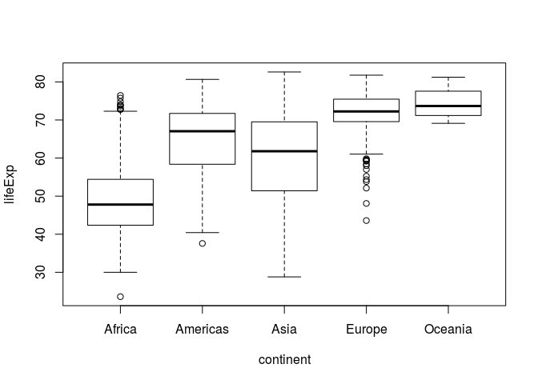
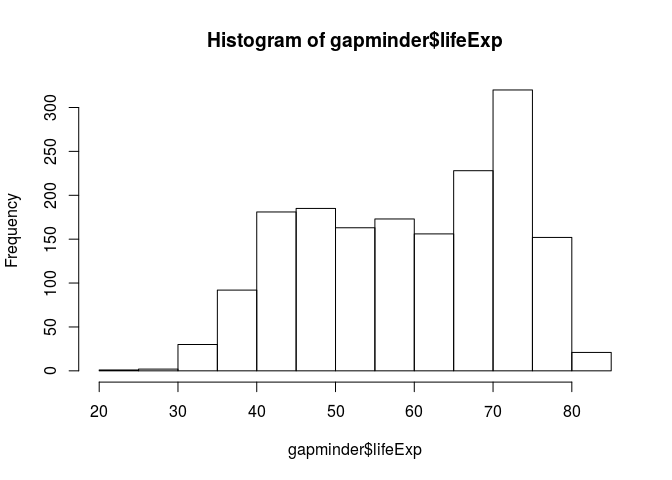

HW 1 Gapminder
================
Sara Sheikholeslami
2017-09-19

``` r
suppressWarnings(suppressMessages(library(tidyverse)))
library(tidyverse);
library(gapminder);
```

1.0 Add R Markdown and Markdown for Gapminder
---------------------------------------------

Overview
--------

### [1.1 Basic info on a data frame](#1)

### [1.2 `dplyr` fundamentals](#2)

#### [1.2.1 filter](#3)

#### [1.2.2 select](#4)

#### [1.2.3 pipeline](#5)

### [1.3 Including Plots](#6)

<a id="1"></a> 1.1 Basic info on a data frame
---------------------------------------------

### Number of columns:

``` r
ncol(gapminder)
```

    ## [1] 6

### Number of rows:

``` r
nrow(gapminder)
```

    ## [1] 1704

<a id="2"></a> 1.2 `dplyr` fundamentals
---------------------------------------

### <a id="3"></a> 1.2.1 filter:

subsets data frames according to some logical expression.

**Exercises**: Find all Europian and African countries, occuring in the '80s with a lifeExp ranging from 70 to 80.

``` r
filter(gapminder, continent %in% c("Europe", "Africa") & 
       year %in% 1980:1989 & lifeExp <= 75.0 &  lifeExp >= 65.0)
```

    ## # A tibble: 47 x 6
    ##                   country continent  year lifeExp      pop gdpPercap
    ##                    <fctr>    <fctr> <int>   <dbl>    <int>     <dbl>
    ##  1                Albania    Europe  1982  70.420  2780097  3630.881
    ##  2                Albania    Europe  1987  72.000  3075321  3738.933
    ##  3                Algeria    Africa  1987  65.799 23254956  5681.359
    ##  4                Austria    Europe  1982  73.180  7574613 21597.084
    ##  5                Austria    Europe  1987  74.940  7578903 23687.826
    ##  6                Belgium    Europe  1982  73.930  9856303 20979.846
    ##  7 Bosnia and Herzegovina    Europe  1982  70.690  4172693  4126.613
    ##  8 Bosnia and Herzegovina    Europe  1987  71.140  4338977  4314.115
    ##  9               Bulgaria    Europe  1982  71.080  8892098  8224.192
    ## 10               Bulgaria    Europe  1987  71.340  8971958  8239.855
    ## # ... with 37 more rows

### <a id="4"></a> 1.2.2 select:

subsets data by columns/variable names. **Exercises**: Take all entries of Europe and Africa occuring in the '80s with a lifeExp ranging from 70 to 80, and select the `country`, `year`, and `lifeExp` columns.

``` r
select(filter(gapminder, continent %in% c("Europe", "Africa") & 
       year %in% 1980:1989 & lifeExp <= 75.0 &  lifeExp >= 65.0),
       country, year, lifeExp)
```

    ## # A tibble: 47 x 3
    ##                   country  year lifeExp
    ##                    <fctr> <int>   <dbl>
    ##  1                Albania  1982  70.420
    ##  2                Albania  1987  72.000
    ##  3                Algeria  1987  65.799
    ##  4                Austria  1982  73.180
    ##  5                Austria  1987  74.940
    ##  6                Belgium  1982  73.930
    ##  7 Bosnia and Herzegovina  1982  70.690
    ##  8 Bosnia and Herzegovina  1987  71.140
    ##  9               Bulgaria  1982  71.080
    ## 10               Bulgaria  1987  71.340
    ## # ... with 37 more rows

### <a id="5"></a> 1.2.3 pipeline:

When doing more than one operation, the **pipe** operator `%>%` feeds the output of a function into another function

**Exercises**: Take all entries of Europe and Africa occuring in the '80s with a lifeExp ranging from 70 to 80, and select the `country`, `year`, and `lifeExp` columns. (similar to previous case)

``` r
gapminder %>% 
    filter(continent %in% c("Europe", "Africa") & 
       year %in% 1980:1989 & lifeExp <= 75.0 & lifeExp >= 65.0) %>%
  select(country, year, lifeExp)
```

    ## # A tibble: 47 x 3
    ##                   country  year lifeExp
    ##                    <fctr> <int>   <dbl>
    ##  1                Albania  1982  70.420
    ##  2                Albania  1987  72.000
    ##  3                Algeria  1987  65.799
    ##  4                Austria  1982  73.180
    ##  5                Austria  1987  74.940
    ##  6                Belgium  1982  73.930
    ##  7 Bosnia and Herzegovina  1982  70.690
    ##  8 Bosnia and Herzegovina  1987  71.140
    ##  9               Bulgaria  1982  71.080
    ## 10               Bulgaria  1987  71.340
    ## # ... with 37 more rows

<a id="6"></a> 1.3 Including Plots
----------------------------------

Embeded plotes using only base R graphics:

``` r
plot(lifeExp ~ continent, gapminder)
```



``` r
hist(gapminder$lifeExp)
```


