HW 2: Explore Gapminder and use dplyr
================
Sara Sheikholeslami
2017-10-04

Overview
========

The following readme document is provided for hw02. This README file includes:

1.  [Make a homework repo](#1)

2.  [Bring rectangular data in](#2)

3.  [Smell test the data](#3)

4.  [Explore individual variables](#4)

5.  [Explore various plot types](#5)

6.  [Use filter(), select() and %&gt;%](#6)

7.  [But I want to do more!](#7)

8.  [Report your process](#8)

<a id="1"></a> 1. Make a homework repo
--------------------------------------

This is the repo for **Homework 02**.

<a id="2"></a> 2. Bring rectangular data in
-------------------------------------------

Let's start by loading the required liberaries:

``` r
suppressWarnings(suppressMessages(library(tidyverse)))
library(tidyverse)
library(gapminder)
```

<a id="3"></a> 3. Smell test the data
-------------------------------------

#### Explore the gapminder object:

**Question 1:** Is it a data.frame, a matrix, a vector, a list?

We can find out using `typeof()` function:

``` r
typeof(gapminder)
```

    ## [1] "list"

**Question 2:** What’s its class?

We can find out using `class` function:

``` r
class(gapminder)
```

    ## [1] "tbl_df"     "tbl"        "data.frame"

As shown above, there are three types of classes in the `gapminder` dataset:

1.  `tbl_df`

2.  `tbl`

3.  `data.frame`

**Question 3:** How many variables/columns?

The number of variables/columns:

``` r
ncol(gapminder)
```

    ## [1] 6

**Question 4:** How many rows/observations?

The number of rows:

``` r
nrow(gapminder)
```

    ## [1] 1704

**Question 5:** Can you get these facts about “extent” or “size” in more than one way? Can you imagine different functions being useful in different contexts?

yes!

1.  You can use `dim` function, it returns the dimensions of your dataset (i.e. both the number of rows and columns):

``` r
dim(gapminder)
```

    ## [1] 1704    6

The first value is the number of rows ***1704***, and the second value is the number of columns/variables ***6***.

1.  You can also use the `str()` function which returns the number of rows as obs. and number of columns as variables:

``` r
str(gapminder)
```

    ## Classes 'tbl_df', 'tbl' and 'data.frame':    1704 obs. of  6 variables:
    ##  $ country  : Factor w/ 142 levels "Afghanistan",..: 1 1 1 1 1 1 1 1 1 1 ...
    ##  $ continent: Factor w/ 5 levels "Africa","Americas",..: 3 3 3 3 3 3 3 3 3 3 ...
    ##  $ year     : int  1952 1957 1962 1967 1972 1977 1982 1987 1992 1997 ...
    ##  $ lifeExp  : num  28.8 30.3 32 34 36.1 ...
    ##  $ pop      : int  8425333 9240934 10267083 11537966 13079460 14880372 12881816 13867957 16317921 22227415 ...
    ##  $ gdpPercap: num  779 821 853 836 740 ...

1.  You can even use functions `NROW()` and `NCOL()` to get the number of rows and columns (all caps!).

``` r
NCOL(gapminder)
```

    ## [1] 6

``` r
NROW(gapminder)
```

    ## [1] 1704

**Question 6:** What data type is each variable?

Using `str()` gets you that information plus extra! (such as the first few values of each variable.). According to this function:

1.  `country  : Factor`

2.  `continent: Factor`

3.  `year     : int`

4.  `lifeExp  : num`

5.  `pop      : int`

6.  `gdpPercap: num`

<a id="4"></a> 4. Explore individual variables
----------------------------------------------

**Question 1:** Pick at least one categorical variable and at least one quantitative variable to explore:

Categorical variable: continent

Quantitative variable: pop

**Question 2:** What are possible values (or range, whichever is appropriate) of each variable?

We can use `summary()` to find the possible values or range of each variable:

continent:

``` r
summary(gapminder$continent)
```

    ##   Africa Americas     Asia   Europe  Oceania 
    ##      624      300      396      360       24

There are 5 continents: Africa, Americas, Asia, Europe and Oceania.

pop

``` r
summary(gapminder$pop)
```

    ##      Min.   1st Qu.    Median      Mean   3rd Qu.      Max. 
    ## 6.001e+04 2.794e+06 7.024e+06 2.960e+07 1.959e+07 1.319e+09

pop ranges from \[6.001e+04, 1.319e+09 \].

**Question 3:** What values are typical? What’s the spread? What’s the distribution? Etc ?

**continent**

``` r
table(gapminder$continent)
```

    ## 
    ##   Africa Americas     Asia   Europe  Oceania 
    ##      624      300      396      360       24

Most data comes from Africa!

**pop**

We can use a histogram:

``` r
hist(gapminder$pop)
```

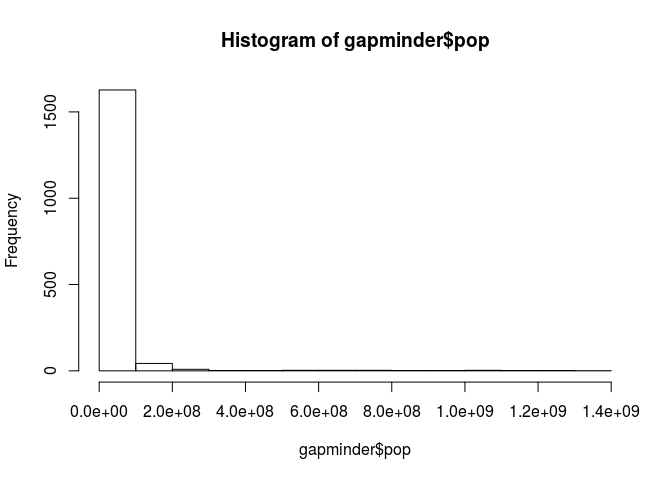

I will go one step further and use the `fitdistrplus` package for distribution fitting. I will use the `functiondescdist` to gain some info on possible candidate distributions.

``` r
library(fitdistrplus)
```

    ## Loading required package: MASS

    ## 
    ## Attaching package: 'MASS'

    ## The following object is masked from 'package:dplyr':
    ## 
    ##     select

    ## Loading required package: survival

``` r
library(logspline)
descdist(gapminder$pop, discrete = FALSE)
```

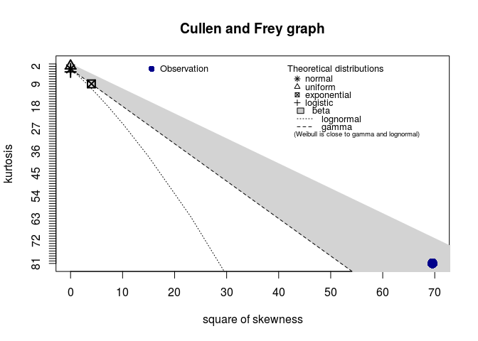

    ## summary statistics
    ## ------
    ## min:  60011   max:  1318683096 
    ## median:  7023596 
    ## mean:  29601212 
    ## estimated sd:  106157897 
    ## estimated skewness:  8.340218 
    ## estimated kurtosis:  80.9482

Let's fit a weibull distribution, and inspect the fit:

``` r
fit.weibull <- fitdist(gapminder$pop, "norm")
plot(fit.weibull)
```

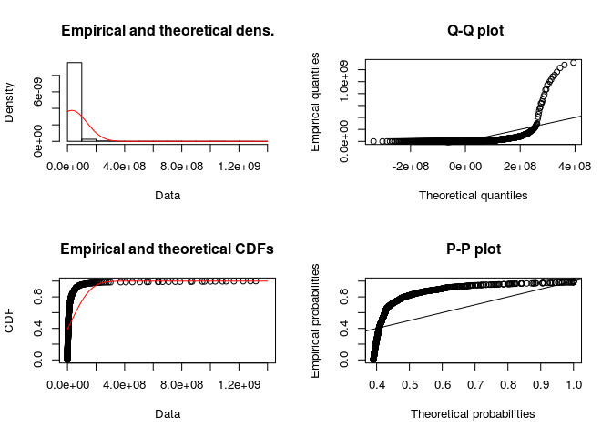

<a id="5"></a> 5. Explore various plot types
--------------------------------------------

**Question 1:** A scatterplot of two quantitative variables.

Let's do a scatter plot of gdpPercap vs lifeExp:

``` r
p <- ggplot(gapminder, aes(x = lifeExp, y = gdpPercap))
# Varying alpha is useful for large datasets
p + geom_point(alpha=0.5)
```

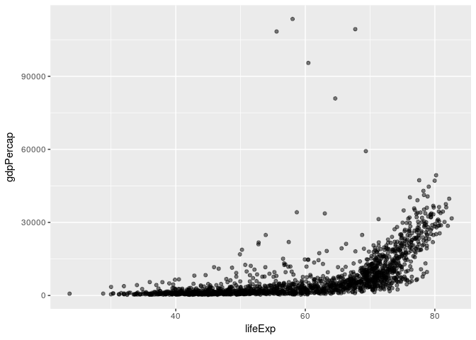

``` r
#Add aesthetic mappings
# p + geom_point(aes(colour = continent))
p + geom_point(aes(shape = continent))
```

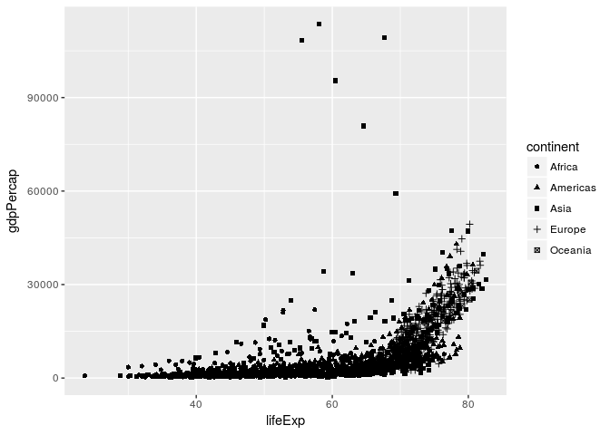

``` r
# Change scales
p + geom_point(aes(colour = continent)) + scale_color_discrete() + scale_y_discrete() + geom_smooth()
```

    ## `geom_smooth()` using method = 'gam'

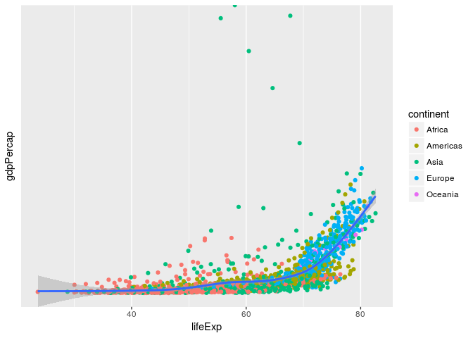 Let's now only consider the data in twwo countries : Afghanestan and Iran

``` r
subset<-gapminder %>%
  filter(country %in% "Iran" | country %in% "Afghanistan") %>%
  dplyr::select(country, lifeExp, gdpPercap) 

ggplot(subset, aes(x = lifeExp, y = gdpPercap))+ geom_point(alpha=0.2) + geom_point(aes(colour = country)) +
  scale_x_log10()+geom_smooth() + scale_color_discrete() + scale_y_discrete() + geom_smooth()
```

    ## `geom_smooth()` using method = 'loess'
    ## `geom_smooth()` using method = 'loess'

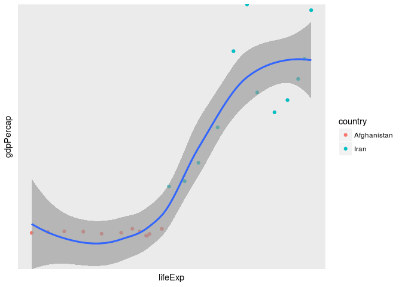

**Question 2:** A plot of one quantitative variable. Maybe a histogram or densityplot or frequency polygon.

Histogram:

``` r
p1<-ggplot(gapminder,aes(x = lifeExp, fill = continent))
p1+geom_histogram(bins = 40, binwidth = 3 ) #+ scale_colour_gradient()
```

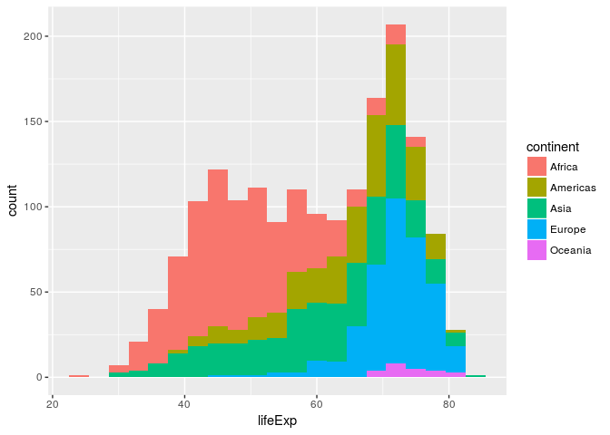 densityplot:

Again, let's only consider two countries : Afghanestan and Iran

``` r
ggplot(subset(gapminder, country %in% c( "Iran", "Afghanistan")), 
  aes(x = lifeExp, fill=country)) + geom_density(alpha = 0.2) #+ geom_point(aes(colour = country)) 
```

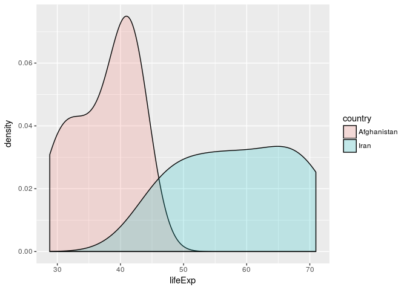

``` r
#ggplot(subset(gapminder, continent),
#       aes(x = lifeExp, fill = continent)) + geom_density(alpha = 0.2)
```

frequency polygon:

``` r
ggplot(subset(gapminder, country %in% c( "Iran", "Afghanistan")), aes(x = lifeExp, color = country)) +geom_freqpoly(bins = 40, binwidth = 3)
```

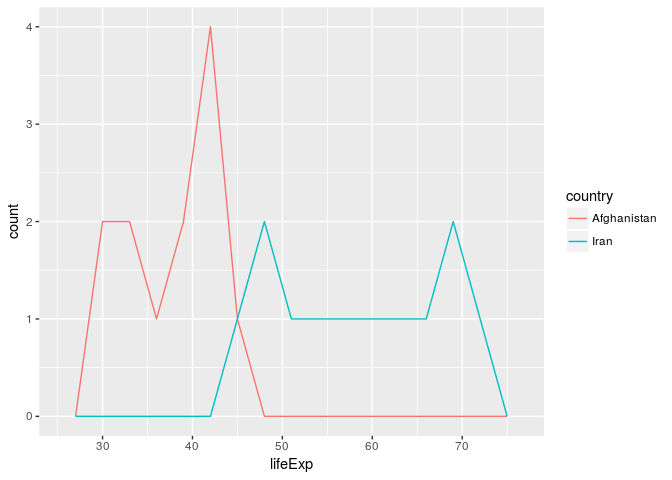

**Question 3:** A plot of one quantitative variable and one categorical. Maybe boxplots for several continents or countries.

Let's explore a subset of the data. Let's look at the life expectancy of Asian countries with `pop` &gt; 5e7

``` r
subset <-gapminder%>%
  group_by(country)%>%
  filter(continent == "Africa", pop > 50000000)
ggplot(subset, aes(x=country,y=lifeExp)) + geom_boxplot(position = "identity", aes(color=country))
```

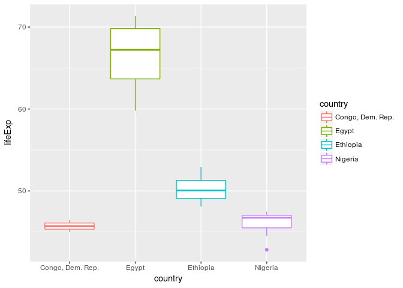

<a id="6"></a> 6. Use filter(), select() and %&gt;%
---------------------------------------------------

Let's look at the gdpPercap vs. lifeExp of "Africa", "Asia" and "Europe".

``` r
subset<-gapminder %>%
  filter(continent %in% c("Africa", "Asia", "Europe")) %>%
  dplyr::select(year, continent, lifeExp, gdpPercap) 

ggplot(subset, aes(x = lifeExp, y = gdpPercap))+ geom_point(alpha=0.2) + geom_point(aes(colour = continent)) +
  geom_smooth()
```

    ## `geom_smooth()` using method = 'gam'

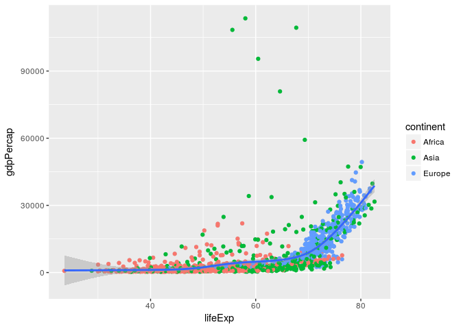

<a id="7"></a> 7. But I want to do more!
----------------------------------------

``` r
knitr::kable(filter(gapminder, country == c("Rwanda", "Afghanistan")), align = 'c', format = 'markdown' )
```

|   country   | continent | year | lifeExp |    pop   | gdpPercap |
|:-----------:|:---------:|:----:|:-------:|:--------:|:---------:|
| Afghanistan |    Asia   | 1957 |  30.332 |  9240934 |  820.8530 |
| Afghanistan |    Asia   | 1967 |  34.020 | 11537966 |  836.1971 |
| Afghanistan |    Asia   | 1977 |  38.438 | 14880372 |  786.1134 |
| Afghanistan |    Asia   | 1987 |  40.822 | 13867957 |  852.3959 |
| Afghanistan |    Asia   | 1997 |  41.763 | 22227415 |  635.3414 |
| Afghanistan |    Asia   | 2007 |  43.828 | 31889923 |  974.5803 |
|    Rwanda   |   Africa  | 1952 |  40.000 |  2534927 |  493.3239 |
|    Rwanda   |   Africa  | 1962 |  43.000 |  3051242 |  597.4731 |
|    Rwanda   |   Africa  | 1972 |  44.600 |  3992121 |  590.5807 |
|    Rwanda   |   Africa  | 1982 |  46.218 |  5507565 |  881.5706 |
|    Rwanda   |   Africa  | 1992 |  23.599 |  7290203 |  737.0686 |
|    Rwanda   |   Africa  | 2002 |  43.413 |  7852401 |  785.6538 |

**Intent is to get the data for Rwanda and Afghanistan**

No they failed! They used the logical operator '==', as we itterate through the countries, each country will be compared **either** to Rwanda or Afghanistan (the value alternates between Rwanda and Afghanistan in each itteration). So, in the worst case scenario, you will miss half of the data!

To get all the data for Rwanda and Afghanistan, we need to use the '%in%' operator:

``` r
knitr::kable(filter(gapminder, country %in% c("Rwanda", "Afghanistan")), align = 'c', format = 'markdown')
```

|   country   | continent | year | lifeExp |    pop   | gdpPercap |
|:-----------:|:---------:|:----:|:-------:|:--------:|:---------:|
| Afghanistan |    Asia   | 1952 |  28.801 |  8425333 |  779.4453 |
| Afghanistan |    Asia   | 1957 |  30.332 |  9240934 |  820.8530 |
| Afghanistan |    Asia   | 1962 |  31.997 | 10267083 |  853.1007 |
| Afghanistan |    Asia   | 1967 |  34.020 | 11537966 |  836.1971 |
| Afghanistan |    Asia   | 1972 |  36.088 | 13079460 |  739.9811 |
| Afghanistan |    Asia   | 1977 |  38.438 | 14880372 |  786.1134 |
| Afghanistan |    Asia   | 1982 |  39.854 | 12881816 |  978.0114 |
| Afghanistan |    Asia   | 1987 |  40.822 | 13867957 |  852.3959 |
| Afghanistan |    Asia   | 1992 |  41.674 | 16317921 |  649.3414 |
| Afghanistan |    Asia   | 1997 |  41.763 | 22227415 |  635.3414 |
| Afghanistan |    Asia   | 2002 |  42.129 | 25268405 |  726.7341 |
| Afghanistan |    Asia   | 2007 |  43.828 | 31889923 |  974.5803 |
|    Rwanda   |   Africa  | 1952 |  40.000 |  2534927 |  493.3239 |
|    Rwanda   |   Africa  | 1957 |  41.500 |  2822082 |  540.2894 |
|    Rwanda   |   Africa  | 1962 |  43.000 |  3051242 |  597.4731 |
|    Rwanda   |   Africa  | 1967 |  44.100 |  3451079 |  510.9637 |
|    Rwanda   |   Africa  | 1972 |  44.600 |  3992121 |  590.5807 |
|    Rwanda   |   Africa  | 1977 |  45.000 |  4657072 |  670.0806 |
|    Rwanda   |   Africa  | 1982 |  46.218 |  5507565 |  881.5706 |
|    Rwanda   |   Africa  | 1987 |  44.020 |  6349365 |  847.9912 |
|    Rwanda   |   Africa  | 1992 |  23.599 |  7290203 |  737.0686 |
|    Rwanda   |   Africa  | 1997 |  36.087 |  7212583 |  589.9445 |
|    Rwanda   |   Africa  | 2002 |  43.413 |  7852401 |  785.6538 |
|    Rwanda   |   Africa  | 2007 |  46.242 |  8860588 |  863.0885 |

<a id="8"></a> 8. Report your process
-------------------------------------

Overall I found this assignment easy to do! I got to explore a lot of different packages and functions in R. The time consuming part of this homework for me was figuring out all the options that come with different plots, and how to best manipulate them for each graph!
