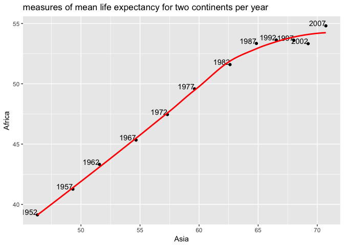

HW 5: Factor and figure management; Repo hygiene
================
Sara Sheikholeslami
2017-11-13

Table of Contents
-----------------

1.  [Factor Management](#1)

    1.1. [Activity \#1: Drop Oceania](#2)

    1.2. [Activity \#2: Reorder the levels of country or continent](#3)

    1.3. [Activity \#3: Practice writing to file and reading back](#4)

2.  [File I/O](#5)

    2.1. [write\_csv()/read\_csv()](#6)

    2.2. [saveRDS()/readRDS()](#7)

3.  [Visualization design](#8)

4.  [Writing figures to file](#9)

5.  [Clean up your repo!](#10)

6.  [But I want to do more!](#11)

7.  [Report your process](#11)

In this homework I will work with the gapminder data. Let's start by loading the required liberaries:

``` r
suppressWarnings(suppressMessages(library(tidyverse)))
library(tidyverse)
library(gapminder)
library(tidyr)
library(plyr)
```

    ## -------------------------------------------------------------------------

    ## You have loaded plyr after dplyr - this is likely to cause problems.
    ## If you need functions from both plyr and dplyr, please load plyr first, then dplyr:
    ## library(plyr); library(dplyr)

    ## -------------------------------------------------------------------------

    ## 
    ## Attaching package: 'plyr'

    ## The following objects are masked from 'package:dplyr':
    ## 
    ##     arrange, count, desc, failwith, id, mutate, rename, summarise,
    ##     summarize

    ## The following object is masked from 'package:purrr':
    ## 
    ##     compact

``` r
library(dplyr)
library(kableExtra)
library(knitr)
library(forcats)
```

Time to tackle the activities!

<a id="1"></a> 1. Factor Management
-----------------------------------

**<a id="2"></a> 1.1. Activity \#1: Drop Oceania**

Let's take a look at the data:

``` r
str(gapminder)
```

    ## Classes 'tbl_df', 'tbl' and 'data.frame':    1704 obs. of  6 variables:
    ##  $ country  : Factor w/ 142 levels "Afghanistan",..: 1 1 1 1 1 1 1 1 1 1 ...
    ##  $ continent: Factor w/ 5 levels "Africa","Americas",..: 3 3 3 3 3 3 3 3 3 3 ...
    ##  $ year     : int  1952 1957 1962 1967 1972 1977 1982 1987 1992 1997 ...
    ##  $ lifeExp  : num  28.8 30.3 32 34 36.1 ...
    ##  $ pop      : int  8425333 9240934 10267083 11537966 13079460 14880372 12881816 13867957 16317921 22227415 ...
    ##  $ gdpPercap: num  779 821 853 836 740 ...

We can see that the original gapminder dataset has 142 different countries, and 5 different continents. Lets learn more about Oceania by using 'fct\_drop()' to only include Oceania:

``` r
OC <- gapminder %>% 
  filter(continent %in% c("Oceania")) 

OC$country %>% 
  fct_drop() %>% 
  levels()
```

    ## [1] "Australia"   "New Zealand"

We can further see that there are two different countries under Oceania. To exclude Oceania, we can filter the data, and then use 'droplevels()':

``` r
#filter the data and drop the extra level (Oceania)
gm_MinusOc <-gapminder %>% 
  filter(continent %in% c("Asia", "Africa", "Europe", "Americas"))%>%
  droplevels()

# let's take a look at the new dataframe
str(gm_MinusOc)
```

    ## Classes 'tbl_df', 'tbl' and 'data.frame':    1680 obs. of  6 variables:
    ##  $ country  : Factor w/ 140 levels "Afghanistan",..: 1 1 1 1 1 1 1 1 1 1 ...
    ##  $ continent: Factor w/ 4 levels "Africa","Americas",..: 3 3 3 3 3 3 3 3 3 3 ...
    ##  $ year     : int  1952 1957 1962 1967 1972 1977 1982 1987 1992 1997 ...
    ##  $ lifeExp  : num  28.8 30.3 32 34 36.1 ...
    ##  $ pop      : int  8425333 9240934 10267083 11537966 13079460 14880372 12881816 13867957 16317921 22227415 ...
    ##  $ gdpPercap: num  779 821 853 836 740 ...

The new dataframe gm\_MinusOc has only 4 continents, and the 2 countries under Oceania are dropped from country variable, leaving only 140 from the original 142 countries. Lets double check this with 'fct\_count()'.

``` r
fct_count(gm_MinusOc$continent)
```

    ## # A tibble: 4 x 2
    ##          f     n
    ##     <fctr> <int>
    ## 1   Africa   624
    ## 2 Americas   300
    ## 3     Asia   396
    ## 4   Europe   360

**<a id="3"></a> 1.2. Activity \#2: Reorder the levels of country or continent**

**<a id="4"></a> 1.3. Activity \#3: Practice writing to file and reading back**

<a id="5"></a> 2. File I/O
--------------------------

**<a id="6"></a> 2.1. write\_csv()/read\_csv()**

**<a id="7"></a> 2.2. saveRDS()/readRDS()**

<a id="8"></a> 3. Visualization design
--------------------------------------

<a id="9"></a> 4. Writing figures to file
-----------------------------------------

<a id="10"></a> 5. Clean up your repo!
--------------------------------------

<a id="11"></a> 6. But I want to do more!
-----------------------------------------

1.  [Report your process](#11)

**<a id="2"></a> 1.1. Activity \#2**

Make a tibble with one row per year and columns for life expectancy for two or more countries. Use knitr::kable() to make this table look pretty in your rendered homework. Take advantage of this new data shape to scatterplot life expectancy for one country against that of another.

Let's create a new data shape that looks at life expectancy for two or more countries per year:

``` r
subset = gapminder %>%
  filter(country %in% c("Iran", "China")) %>%
  select(year, country, lifeExp) %>%
  spread(country, lifeExp)
```

Now let's make a tibble representing this new data shape:

``` r
library("kableExtra")
html_table_width <- function(kable_output, width){
  width_html <- paste0(paste0('<col width="', width, '">'), collapse = "\n")
  sub("<table>", paste0("<table>\n", width_html), kable_output)}

knitr::kable(subset, format = "html", booktabs = TRUE, caption = 'Table of life expectancy changing over time on two different countries') %>%
  html_table_width(c(0,100,100))
```

<table>
<col width="0">
<col width="100">
<col width="100">
<caption>
Table of life expectancy changing over time on two different countries
</caption>
<thead>
<tr>
<th style="text-align:right;">
year
</th>
<th style="text-align:right;">
China
</th>
<th style="text-align:right;">
Iran
</th>
</tr>
</thead>
<tbody>
<tr>
<td style="text-align:right;">
1952
</td>
<td style="text-align:right;">
44.00000
</td>
<td style="text-align:right;">
44.869
</td>
</tr>
<tr>
<td style="text-align:right;">
1957
</td>
<td style="text-align:right;">
50.54896
</td>
<td style="text-align:right;">
47.181
</td>
</tr>
<tr>
<td style="text-align:right;">
1962
</td>
<td style="text-align:right;">
44.50136
</td>
<td style="text-align:right;">
49.325
</td>
</tr>
<tr>
<td style="text-align:right;">
1967
</td>
<td style="text-align:right;">
58.38112
</td>
<td style="text-align:right;">
52.469
</td>
</tr>
<tr>
<td style="text-align:right;">
1972
</td>
<td style="text-align:right;">
63.11888
</td>
<td style="text-align:right;">
55.234
</td>
</tr>
<tr>
<td style="text-align:right;">
1977
</td>
<td style="text-align:right;">
63.96736
</td>
<td style="text-align:right;">
57.702
</td>
</tr>
<tr>
<td style="text-align:right;">
1982
</td>
<td style="text-align:right;">
65.52500
</td>
<td style="text-align:right;">
59.620
</td>
</tr>
<tr>
<td style="text-align:right;">
1987
</td>
<td style="text-align:right;">
67.27400
</td>
<td style="text-align:right;">
63.040
</td>
</tr>
<tr>
<td style="text-align:right;">
1992
</td>
<td style="text-align:right;">
68.69000
</td>
<td style="text-align:right;">
65.742
</td>
</tr>
<tr>
<td style="text-align:right;">
1997
</td>
<td style="text-align:right;">
70.42600
</td>
<td style="text-align:right;">
68.042
</td>
</tr>
<tr>
<td style="text-align:right;">
2002
</td>
<td style="text-align:right;">
72.02800
</td>
<td style="text-align:right;">
69.451
</td>
</tr>
<tr>
<td style="text-align:right;">
2007
</td>
<td style="text-align:right;">
72.96100
</td>
<td style="text-align:right;">
70.964
</td>
</tr>
</tbody>
</table>
Now let's plot the results:

``` r
subset%>%
  ggplot(aes(x=China,y=Iran)) + geom_point()+labs(title=" life expectancy changing over time on two different countries")+geom_text(aes(label=year),hjust=1, vjust=0)+
   geom_smooth(se=FALSE, colour="red")
```

    ## `geom_smooth()` using method = 'loess'



Let's try a different representation:

``` r
subset = gapminder %>%
        select(year, country, lifeExp) %>%
        filter(country %in% c("Iran", "China"))

subset%>%
  ggplot(aes(x = year, y = lifeExp, colour = country)) +
  geom_point() + 
  geom_line() +
  theme(legend.title = element_text(size=12, face="bold"), legend.text = element_text(size=12)) +
  labs(x = "Year", y = "Life Expectancy", title = "life expectancy changing over time on two different countrie") 
```


**<a id="3"></a> 1.2. Activity \#3**

Considering all the measures of life expectancy:

``` r
subset2<-gapminder%>%
  group_by(continent,year)%>%
  summarise(meanLE=mean(lifeExp),medianLE=median(lifeExp),minLE=min(lifeExp),maxLE=max(lifeExp))

html_table_width <- function(kable_output, width){
  width_html <- paste0(paste0('<col width="', width, '">'), collapse = "\n")
  sub("<table>", paste0("<table>\n", width_html), kable_output)}

knitr::kable(subset2, format = "html", booktabs = TRUE, caption = 'Different measures of life expectancy (mean, median, min and max) for all possible combinations of continent and year') %>%
  html_table_width(c(0,100,100,100,100,100))
```

<table>
<col width="0">
<col width="100">
<col width="100">
<col width="100">
<col width="100">
<col width="100">
<caption>
Different measures of life expectancy (mean, median, min and max) for all possible combinations of continent and year
</caption>
<thead>
<tr>
<th style="text-align:right;">
meanLE
</th>
<th style="text-align:right;">
medianLE
</th>
<th style="text-align:right;">
minLE
</th>
<th style="text-align:right;">
maxLE
</th>
</tr>
</thead>
<tbody>
<tr>
<td style="text-align:right;">
59.47444
</td>
<td style="text-align:right;">
60.7125
</td>
<td style="text-align:right;">
23.599
</td>
<td style="text-align:right;">
82.603
</td>
</tr>
</tbody>
</table>
<a id="11"></a> 3. Report your process
--------------------------------------

Overall I found this assignment easy to do. - I spent a lot of time trying to do 3d scatter plots but I was not able to generate a sensible visualization.... - I found using the join functions over and over a bit tedious!
