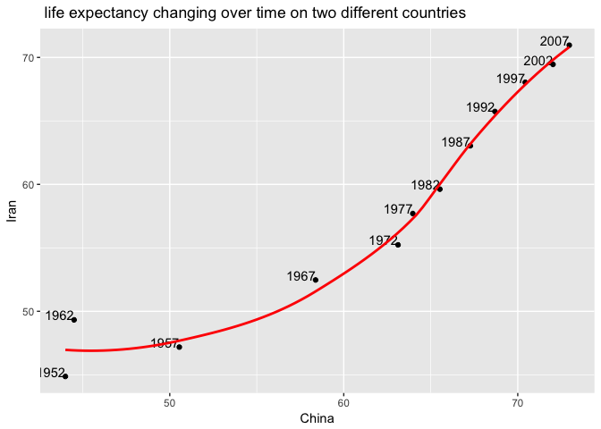
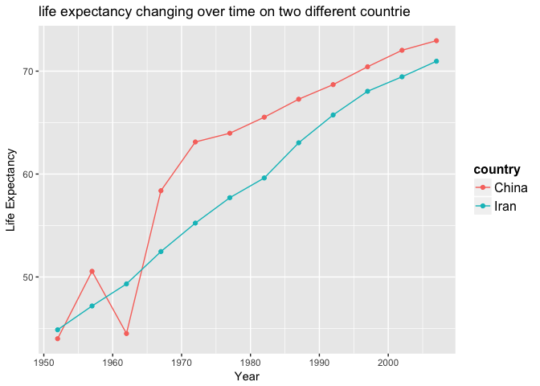
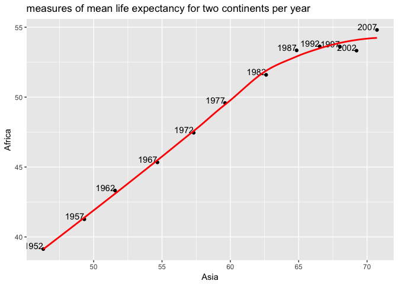

HW 4: Tidy data and joins
================
Sara Sheikholeslami
2017-10-11

1.  [General data reshaping and relationship to aggregation](#1)

    1.1. [Activity \#2](#2)

    1.2. [Activity \#3](#3)

2.  [Join, merge, look up](#4)

    2.1. [left join](#5)

    2.2. [right join](#6)

    2.3. [inner join](#7)

    2.4. [full join](#8)

    2.5. [semi join](#9)

    2.6. [anti join](#10)

3.  [Report your process](#11)

<a id="1"></a> 1. General data reshaping and relationship to aggregation
------------------------------------------------------------------------

Let's start by loading the required liberaries:

``` r
suppressWarnings(suppressMessages(library(tidyverse)))
library(tidyverse)
library(gapminder)
```

Time to tackle the activities!

**<a id="2"></a> 1.1. Activity \#2**

Make a tibble with one row per year and columns for life expectancy for two or more countries. Use knitr::kable() to make this table look pretty in your rendered homework. Take advantage of this new data shape to scatterplot life expectancy for one country against that of another.

Let's create a new data shape that looks at life expectancy for two or more countries per year:

``` r
subset = gapminder %>%
  filter(country %in% c("Iran", "China")) %>%
  select(year, country, lifeExp) %>%
  spread(country, lifeExp)
```

Now let's make a tibble representing this new data shape:

``` r
library("kableExtra")
html_table_width <- function(kable_output, width){
  width_html <- paste0(paste0('<col width="', width, '">'), collapse = "\n")
  sub("<table>", paste0("<table>\n", width_html), kable_output)}

knitr::kable(subset, format = "html", booktabs = TRUE, caption = 'Table of life expectancy changing over time on two different countries') %>%
  html_table_width(c(0,100,100))
```

<table>
<col width="0">
<col width="100">
<col width="100">
<caption>
Table of life expectancy changing over time on two different countries
</caption>
<thead>
<tr>
<th style="text-align:right;">
year
</th>
<th style="text-align:right;">
China
</th>
<th style="text-align:right;">
Iran
</th>
</tr>
</thead>
<tbody>
<tr>
<td style="text-align:right;">
1952
</td>
<td style="text-align:right;">
44.00000
</td>
<td style="text-align:right;">
44.869
</td>
</tr>
<tr>
<td style="text-align:right;">
1957
</td>
<td style="text-align:right;">
50.54896
</td>
<td style="text-align:right;">
47.181
</td>
</tr>
<tr>
<td style="text-align:right;">
1962
</td>
<td style="text-align:right;">
44.50136
</td>
<td style="text-align:right;">
49.325
</td>
</tr>
<tr>
<td style="text-align:right;">
1967
</td>
<td style="text-align:right;">
58.38112
</td>
<td style="text-align:right;">
52.469
</td>
</tr>
<tr>
<td style="text-align:right;">
1972
</td>
<td style="text-align:right;">
63.11888
</td>
<td style="text-align:right;">
55.234
</td>
</tr>
<tr>
<td style="text-align:right;">
1977
</td>
<td style="text-align:right;">
63.96736
</td>
<td style="text-align:right;">
57.702
</td>
</tr>
<tr>
<td style="text-align:right;">
1982
</td>
<td style="text-align:right;">
65.52500
</td>
<td style="text-align:right;">
59.620
</td>
</tr>
<tr>
<td style="text-align:right;">
1987
</td>
<td style="text-align:right;">
67.27400
</td>
<td style="text-align:right;">
63.040
</td>
</tr>
<tr>
<td style="text-align:right;">
1992
</td>
<td style="text-align:right;">
68.69000
</td>
<td style="text-align:right;">
65.742
</td>
</tr>
<tr>
<td style="text-align:right;">
1997
</td>
<td style="text-align:right;">
70.42600
</td>
<td style="text-align:right;">
68.042
</td>
</tr>
<tr>
<td style="text-align:right;">
2002
</td>
<td style="text-align:right;">
72.02800
</td>
<td style="text-align:right;">
69.451
</td>
</tr>
<tr>
<td style="text-align:right;">
2007
</td>
<td style="text-align:right;">
72.96100
</td>
<td style="text-align:right;">
70.964
</td>
</tr>
</tbody>
</table>
Now let's plot the results:

``` r
subset%>%
  ggplot(aes(x=China,y=Iran)) + geom_point()+labs(title=" life expectancy changing over time on two different countries")+geom_text(aes(label=year),hjust=1, vjust=0)+
   geom_smooth(se=FALSE, colour="red")
```

    ## `geom_smooth()` using method = 'loess'



Let's try a different representation:

``` r
subset = gapminder %>%
        select(year, country, lifeExp) %>%
        filter(country %in% c("Iran", "China"))

subset%>%
  ggplot(aes(x = year, y = lifeExp, colour = country)) +
  geom_point() + 
  geom_line() +
  theme(legend.title = element_text(size=12, face="bold"), legend.text = element_text(size=12)) +
  labs(x = "Year", y = "Life Expectancy", title = "life expectancy changing over time on two different countrie") 
```



**<a id="3"></a> 1.2. Activity \#3**

Considering all the measures of life expectancy:

``` r
subset2<-gapminder%>%
  group_by(continent,year)%>%
  summarise(meanLE=mean(lifeExp),medianLE=median(lifeExp),minLE=min(lifeExp),maxLE=max(lifeExp))

html_table_width <- function(kable_output, width){
  width_html <- paste0(paste0('<col width="', width, '">'), collapse = "\n")
  sub("<table>", paste0("<table>\n", width_html), kable_output)}

knitr::kable(subset2, format = "html", booktabs = TRUE, caption = 'Different measures of life expectancy (mean, median, min and max) for all possible combinations of continent and year') %>%
  html_table_width(c(0,100,100,100,100,100))
```

<table>
<col width="0">
<col width="100">
<col width="100">
<col width="100">
<col width="100">
<col width="100">
<caption>
Different measures of life expectancy (mean, median, min and max) for all possible combinations of continent and year
</caption>
<thead>
<tr>
<th style="text-align:left;">
continent
</th>
<th style="text-align:right;">
year
</th>
<th style="text-align:right;">
meanLE
</th>
<th style="text-align:right;">
medianLE
</th>
<th style="text-align:right;">
minLE
</th>
<th style="text-align:right;">
maxLE
</th>
</tr>
</thead>
<tbody>
<tr>
<td style="text-align:left;">
Africa
</td>
<td style="text-align:right;">
1952
</td>
<td style="text-align:right;">
39.13550
</td>
<td style="text-align:right;">
38.8330
</td>
<td style="text-align:right;">
30.000
</td>
<td style="text-align:right;">
52.724
</td>
</tr>
<tr>
<td style="text-align:left;">
Africa
</td>
<td style="text-align:right;">
1957
</td>
<td style="text-align:right;">
41.26635
</td>
<td style="text-align:right;">
40.5925
</td>
<td style="text-align:right;">
31.570
</td>
<td style="text-align:right;">
58.089
</td>
</tr>
<tr>
<td style="text-align:left;">
Africa
</td>
<td style="text-align:right;">
1962
</td>
<td style="text-align:right;">
43.31944
</td>
<td style="text-align:right;">
42.6305
</td>
<td style="text-align:right;">
32.767
</td>
<td style="text-align:right;">
60.246
</td>
</tr>
<tr>
<td style="text-align:left;">
Africa
</td>
<td style="text-align:right;">
1967
</td>
<td style="text-align:right;">
45.33454
</td>
<td style="text-align:right;">
44.6985
</td>
<td style="text-align:right;">
34.113
</td>
<td style="text-align:right;">
61.557
</td>
</tr>
<tr>
<td style="text-align:left;">
Africa
</td>
<td style="text-align:right;">
1972
</td>
<td style="text-align:right;">
47.45094
</td>
<td style="text-align:right;">
47.0315
</td>
<td style="text-align:right;">
35.400
</td>
<td style="text-align:right;">
64.274
</td>
</tr>
<tr>
<td style="text-align:left;">
Africa
</td>
<td style="text-align:right;">
1977
</td>
<td style="text-align:right;">
49.58042
</td>
<td style="text-align:right;">
49.2725
</td>
<td style="text-align:right;">
36.788
</td>
<td style="text-align:right;">
67.064
</td>
</tr>
<tr>
<td style="text-align:left;">
Africa
</td>
<td style="text-align:right;">
1982
</td>
<td style="text-align:right;">
51.59287
</td>
<td style="text-align:right;">
50.7560
</td>
<td style="text-align:right;">
38.445
</td>
<td style="text-align:right;">
69.885
</td>
</tr>
<tr>
<td style="text-align:left;">
Africa
</td>
<td style="text-align:right;">
1987
</td>
<td style="text-align:right;">
53.34479
</td>
<td style="text-align:right;">
51.6395
</td>
<td style="text-align:right;">
39.906
</td>
<td style="text-align:right;">
71.913
</td>
</tr>
<tr>
<td style="text-align:left;">
Africa
</td>
<td style="text-align:right;">
1992
</td>
<td style="text-align:right;">
53.62958
</td>
<td style="text-align:right;">
52.4290
</td>
<td style="text-align:right;">
23.599
</td>
<td style="text-align:right;">
73.615
</td>
</tr>
<tr>
<td style="text-align:left;">
Africa
</td>
<td style="text-align:right;">
1997
</td>
<td style="text-align:right;">
53.59827
</td>
<td style="text-align:right;">
52.7590
</td>
<td style="text-align:right;">
36.087
</td>
<td style="text-align:right;">
74.772
</td>
</tr>
<tr>
<td style="text-align:left;">
Africa
</td>
<td style="text-align:right;">
2002
</td>
<td style="text-align:right;">
53.32523
</td>
<td style="text-align:right;">
51.2355
</td>
<td style="text-align:right;">
39.193
</td>
<td style="text-align:right;">
75.744
</td>
</tr>
<tr>
<td style="text-align:left;">
Africa
</td>
<td style="text-align:right;">
2007
</td>
<td style="text-align:right;">
54.80604
</td>
<td style="text-align:right;">
52.9265
</td>
<td style="text-align:right;">
39.613
</td>
<td style="text-align:right;">
76.442
</td>
</tr>
<tr>
<td style="text-align:left;">
Americas
</td>
<td style="text-align:right;">
1952
</td>
<td style="text-align:right;">
53.27984
</td>
<td style="text-align:right;">
54.7450
</td>
<td style="text-align:right;">
37.579
</td>
<td style="text-align:right;">
68.750
</td>
</tr>
<tr>
<td style="text-align:left;">
Americas
</td>
<td style="text-align:right;">
1957
</td>
<td style="text-align:right;">
55.96028
</td>
<td style="text-align:right;">
56.0740
</td>
<td style="text-align:right;">
40.696
</td>
<td style="text-align:right;">
69.960
</td>
</tr>
<tr>
<td style="text-align:left;">
Americas
</td>
<td style="text-align:right;">
1962
</td>
<td style="text-align:right;">
58.39876
</td>
<td style="text-align:right;">
58.2990
</td>
<td style="text-align:right;">
43.428
</td>
<td style="text-align:right;">
71.300
</td>
</tr>
<tr>
<td style="text-align:left;">
Americas
</td>
<td style="text-align:right;">
1967
</td>
<td style="text-align:right;">
60.41092
</td>
<td style="text-align:right;">
60.5230
</td>
<td style="text-align:right;">
45.032
</td>
<td style="text-align:right;">
72.130
</td>
</tr>
<tr>
<td style="text-align:left;">
Americas
</td>
<td style="text-align:right;">
1972
</td>
<td style="text-align:right;">
62.39492
</td>
<td style="text-align:right;">
63.4410
</td>
<td style="text-align:right;">
46.714
</td>
<td style="text-align:right;">
72.880
</td>
</tr>
<tr>
<td style="text-align:left;">
Americas
</td>
<td style="text-align:right;">
1977
</td>
<td style="text-align:right;">
64.39156
</td>
<td style="text-align:right;">
66.3530
</td>
<td style="text-align:right;">
49.923
</td>
<td style="text-align:right;">
74.210
</td>
</tr>
<tr>
<td style="text-align:left;">
Americas
</td>
<td style="text-align:right;">
1982
</td>
<td style="text-align:right;">
66.22884
</td>
<td style="text-align:right;">
67.4050
</td>
<td style="text-align:right;">
51.461
</td>
<td style="text-align:right;">
75.760
</td>
</tr>
<tr>
<td style="text-align:left;">
Americas
</td>
<td style="text-align:right;">
1987
</td>
<td style="text-align:right;">
68.09072
</td>
<td style="text-align:right;">
69.4980
</td>
<td style="text-align:right;">
53.636
</td>
<td style="text-align:right;">
76.860
</td>
</tr>
<tr>
<td style="text-align:left;">
Americas
</td>
<td style="text-align:right;">
1992
</td>
<td style="text-align:right;">
69.56836
</td>
<td style="text-align:right;">
69.8620
</td>
<td style="text-align:right;">
55.089
</td>
<td style="text-align:right;">
77.950
</td>
</tr>
<tr>
<td style="text-align:left;">
Americas
</td>
<td style="text-align:right;">
1997
</td>
<td style="text-align:right;">
71.15048
</td>
<td style="text-align:right;">
72.1460
</td>
<td style="text-align:right;">
56.671
</td>
<td style="text-align:right;">
78.610
</td>
</tr>
<tr>
<td style="text-align:left;">
Americas
</td>
<td style="text-align:right;">
2002
</td>
<td style="text-align:right;">
72.42204
</td>
<td style="text-align:right;">
72.0470
</td>
<td style="text-align:right;">
58.137
</td>
<td style="text-align:right;">
79.770
</td>
</tr>
<tr>
<td style="text-align:left;">
Americas
</td>
<td style="text-align:right;">
2007
</td>
<td style="text-align:right;">
73.60812
</td>
<td style="text-align:right;">
72.8990
</td>
<td style="text-align:right;">
60.916
</td>
<td style="text-align:right;">
80.653
</td>
</tr>
<tr>
<td style="text-align:left;">
Asia
</td>
<td style="text-align:right;">
1952
</td>
<td style="text-align:right;">
46.31439
</td>
<td style="text-align:right;">
44.8690
</td>
<td style="text-align:right;">
28.801
</td>
<td style="text-align:right;">
65.390
</td>
</tr>
<tr>
<td style="text-align:left;">
Asia
</td>
<td style="text-align:right;">
1957
</td>
<td style="text-align:right;">
49.31854
</td>
<td style="text-align:right;">
48.2840
</td>
<td style="text-align:right;">
30.332
</td>
<td style="text-align:right;">
67.840
</td>
</tr>
<tr>
<td style="text-align:left;">
Asia
</td>
<td style="text-align:right;">
1962
</td>
<td style="text-align:right;">
51.56322
</td>
<td style="text-align:right;">
49.3250
</td>
<td style="text-align:right;">
31.997
</td>
<td style="text-align:right;">
69.390
</td>
</tr>
<tr>
<td style="text-align:left;">
Asia
</td>
<td style="text-align:right;">
1967
</td>
<td style="text-align:right;">
54.66364
</td>
<td style="text-align:right;">
53.6550
</td>
<td style="text-align:right;">
34.020
</td>
<td style="text-align:right;">
71.430
</td>
</tr>
<tr>
<td style="text-align:left;">
Asia
</td>
<td style="text-align:right;">
1972
</td>
<td style="text-align:right;">
57.31927
</td>
<td style="text-align:right;">
56.9500
</td>
<td style="text-align:right;">
36.088
</td>
<td style="text-align:right;">
73.420
</td>
</tr>
<tr>
<td style="text-align:left;">
Asia
</td>
<td style="text-align:right;">
1977
</td>
<td style="text-align:right;">
59.61056
</td>
<td style="text-align:right;">
60.7650
</td>
<td style="text-align:right;">
31.220
</td>
<td style="text-align:right;">
75.380
</td>
</tr>
<tr>
<td style="text-align:left;">
Asia
</td>
<td style="text-align:right;">
1982
</td>
<td style="text-align:right;">
62.61794
</td>
<td style="text-align:right;">
63.7390
</td>
<td style="text-align:right;">
39.854
</td>
<td style="text-align:right;">
77.110
</td>
</tr>
<tr>
<td style="text-align:left;">
Asia
</td>
<td style="text-align:right;">
1987
</td>
<td style="text-align:right;">
64.85118
</td>
<td style="text-align:right;">
66.2950
</td>
<td style="text-align:right;">
40.822
</td>
<td style="text-align:right;">
78.670
</td>
</tr>
<tr>
<td style="text-align:left;">
Asia
</td>
<td style="text-align:right;">
1992
</td>
<td style="text-align:right;">
66.53721
</td>
<td style="text-align:right;">
68.6900
</td>
<td style="text-align:right;">
41.674
</td>
<td style="text-align:right;">
79.360
</td>
</tr>
<tr>
<td style="text-align:left;">
Asia
</td>
<td style="text-align:right;">
1997
</td>
<td style="text-align:right;">
68.02052
</td>
<td style="text-align:right;">
70.2650
</td>
<td style="text-align:right;">
41.763
</td>
<td style="text-align:right;">
80.690
</td>
</tr>
<tr>
<td style="text-align:left;">
Asia
</td>
<td style="text-align:right;">
2002
</td>
<td style="text-align:right;">
69.23388
</td>
<td style="text-align:right;">
71.0280
</td>
<td style="text-align:right;">
42.129
</td>
<td style="text-align:right;">
82.000
</td>
</tr>
<tr>
<td style="text-align:left;">
Asia
</td>
<td style="text-align:right;">
2007
</td>
<td style="text-align:right;">
70.72848
</td>
<td style="text-align:right;">
72.3960
</td>
<td style="text-align:right;">
43.828
</td>
<td style="text-align:right;">
82.603
</td>
</tr>
<tr>
<td style="text-align:left;">
Europe
</td>
<td style="text-align:right;">
1952
</td>
<td style="text-align:right;">
64.40850
</td>
<td style="text-align:right;">
65.9000
</td>
<td style="text-align:right;">
43.585
</td>
<td style="text-align:right;">
72.670
</td>
</tr>
<tr>
<td style="text-align:left;">
Europe
</td>
<td style="text-align:right;">
1957
</td>
<td style="text-align:right;">
66.70307
</td>
<td style="text-align:right;">
67.6500
</td>
<td style="text-align:right;">
48.079
</td>
<td style="text-align:right;">
73.470
</td>
</tr>
<tr>
<td style="text-align:left;">
Europe
</td>
<td style="text-align:right;">
1962
</td>
<td style="text-align:right;">
68.53923
</td>
<td style="text-align:right;">
69.5250
</td>
<td style="text-align:right;">
52.098
</td>
<td style="text-align:right;">
73.680
</td>
</tr>
<tr>
<td style="text-align:left;">
Europe
</td>
<td style="text-align:right;">
1967
</td>
<td style="text-align:right;">
69.73760
</td>
<td style="text-align:right;">
70.6100
</td>
<td style="text-align:right;">
54.336
</td>
<td style="text-align:right;">
74.160
</td>
</tr>
<tr>
<td style="text-align:left;">
Europe
</td>
<td style="text-align:right;">
1972
</td>
<td style="text-align:right;">
70.77503
</td>
<td style="text-align:right;">
70.8850
</td>
<td style="text-align:right;">
57.005
</td>
<td style="text-align:right;">
74.720
</td>
</tr>
<tr>
<td style="text-align:left;">
Europe
</td>
<td style="text-align:right;">
1977
</td>
<td style="text-align:right;">
71.93777
</td>
<td style="text-align:right;">
72.3350
</td>
<td style="text-align:right;">
59.507
</td>
<td style="text-align:right;">
76.110
</td>
</tr>
<tr>
<td style="text-align:left;">
Europe
</td>
<td style="text-align:right;">
1982
</td>
<td style="text-align:right;">
72.80640
</td>
<td style="text-align:right;">
73.4900
</td>
<td style="text-align:right;">
61.036
</td>
<td style="text-align:right;">
76.990
</td>
</tr>
<tr>
<td style="text-align:left;">
Europe
</td>
<td style="text-align:right;">
1987
</td>
<td style="text-align:right;">
73.64217
</td>
<td style="text-align:right;">
74.8150
</td>
<td style="text-align:right;">
63.108
</td>
<td style="text-align:right;">
77.410
</td>
</tr>
<tr>
<td style="text-align:left;">
Europe
</td>
<td style="text-align:right;">
1992
</td>
<td style="text-align:right;">
74.44010
</td>
<td style="text-align:right;">
75.4510
</td>
<td style="text-align:right;">
66.146
</td>
<td style="text-align:right;">
78.770
</td>
</tr>
<tr>
<td style="text-align:left;">
Europe
</td>
<td style="text-align:right;">
1997
</td>
<td style="text-align:right;">
75.50517
</td>
<td style="text-align:right;">
76.1160
</td>
<td style="text-align:right;">
68.835
</td>
<td style="text-align:right;">
79.390
</td>
</tr>
<tr>
<td style="text-align:left;">
Europe
</td>
<td style="text-align:right;">
2002
</td>
<td style="text-align:right;">
76.70060
</td>
<td style="text-align:right;">
77.5365
</td>
<td style="text-align:right;">
70.845
</td>
<td style="text-align:right;">
80.620
</td>
</tr>
<tr>
<td style="text-align:left;">
Europe
</td>
<td style="text-align:right;">
2007
</td>
<td style="text-align:right;">
77.64860
</td>
<td style="text-align:right;">
78.6085
</td>
<td style="text-align:right;">
71.777
</td>
<td style="text-align:right;">
81.757
</td>
</tr>
<tr>
<td style="text-align:left;">
Oceania
</td>
<td style="text-align:right;">
1952
</td>
<td style="text-align:right;">
69.25500
</td>
<td style="text-align:right;">
69.2550
</td>
<td style="text-align:right;">
69.120
</td>
<td style="text-align:right;">
69.390
</td>
</tr>
<tr>
<td style="text-align:left;">
Oceania
</td>
<td style="text-align:right;">
1957
</td>
<td style="text-align:right;">
70.29500
</td>
<td style="text-align:right;">
70.2950
</td>
<td style="text-align:right;">
70.260
</td>
<td style="text-align:right;">
70.330
</td>
</tr>
<tr>
<td style="text-align:left;">
Oceania
</td>
<td style="text-align:right;">
1962
</td>
<td style="text-align:right;">
71.08500
</td>
<td style="text-align:right;">
71.0850
</td>
<td style="text-align:right;">
70.930
</td>
<td style="text-align:right;">
71.240
</td>
</tr>
<tr>
<td style="text-align:left;">
Oceania
</td>
<td style="text-align:right;">
1967
</td>
<td style="text-align:right;">
71.31000
</td>
<td style="text-align:right;">
71.3100
</td>
<td style="text-align:right;">
71.100
</td>
<td style="text-align:right;">
71.520
</td>
</tr>
<tr>
<td style="text-align:left;">
Oceania
</td>
<td style="text-align:right;">
1972
</td>
<td style="text-align:right;">
71.91000
</td>
<td style="text-align:right;">
71.9100
</td>
<td style="text-align:right;">
71.890
</td>
<td style="text-align:right;">
71.930
</td>
</tr>
<tr>
<td style="text-align:left;">
Oceania
</td>
<td style="text-align:right;">
1977
</td>
<td style="text-align:right;">
72.85500
</td>
<td style="text-align:right;">
72.8550
</td>
<td style="text-align:right;">
72.220
</td>
<td style="text-align:right;">
73.490
</td>
</tr>
<tr>
<td style="text-align:left;">
Oceania
</td>
<td style="text-align:right;">
1982
</td>
<td style="text-align:right;">
74.29000
</td>
<td style="text-align:right;">
74.2900
</td>
<td style="text-align:right;">
73.840
</td>
<td style="text-align:right;">
74.740
</td>
</tr>
<tr>
<td style="text-align:left;">
Oceania
</td>
<td style="text-align:right;">
1987
</td>
<td style="text-align:right;">
75.32000
</td>
<td style="text-align:right;">
75.3200
</td>
<td style="text-align:right;">
74.320
</td>
<td style="text-align:right;">
76.320
</td>
</tr>
<tr>
<td style="text-align:left;">
Oceania
</td>
<td style="text-align:right;">
1992
</td>
<td style="text-align:right;">
76.94500
</td>
<td style="text-align:right;">
76.9450
</td>
<td style="text-align:right;">
76.330
</td>
<td style="text-align:right;">
77.560
</td>
</tr>
<tr>
<td style="text-align:left;">
Oceania
</td>
<td style="text-align:right;">
1997
</td>
<td style="text-align:right;">
78.19000
</td>
<td style="text-align:right;">
78.1900
</td>
<td style="text-align:right;">
77.550
</td>
<td style="text-align:right;">
78.830
</td>
</tr>
<tr>
<td style="text-align:left;">
Oceania
</td>
<td style="text-align:right;">
2002
</td>
<td style="text-align:right;">
79.74000
</td>
<td style="text-align:right;">
79.7400
</td>
<td style="text-align:right;">
79.110
</td>
<td style="text-align:right;">
80.370
</td>
</tr>
<tr>
<td style="text-align:left;">
Oceania
</td>
<td style="text-align:right;">
2007
</td>
<td style="text-align:right;">
80.71950
</td>
<td style="text-align:right;">
80.7195
</td>
<td style="text-align:right;">
80.204
</td>
<td style="text-align:right;">
81.235
</td>
</tr>
</tbody>
</table>
Now let's only look at the mean values:

A: Reshape data to have one row per year and one variable for each continent.

``` r
subset3<-subset2%>%
  select(year,continent,meanLE)%>%
  spread(key=continent, value=meanLE)

knitr::kable(subset3, format = "html", booktabs = TRUE, caption = 'measures of mean life expectancy for all possible combinations of continent and year') %>%
  html_table_width(c(0,100,100,100,100,100))%>%
  kable_styling(bootstrap_options = c("striped", "hover"))
```

<table class="table table-striped table-hover" style="margin-left: auto; margin-right: auto;">
<col width="0">
<col width="100">
<col width="100">
<col width="100">
<col width="100">
<col width="100">
<caption>
measures of mean life expectancy for all possible combinations of continent and year
</caption>
<thead>
<tr>
<th style="text-align:right;">
year
</th>
<th style="text-align:right;">
Africa
</th>
<th style="text-align:right;">
Americas
</th>
<th style="text-align:right;">
Asia
</th>
<th style="text-align:right;">
Europe
</th>
<th style="text-align:right;">
Oceania
</th>
</tr>
</thead>
<tbody>
<tr>
<td style="text-align:right;">
1952
</td>
<td style="text-align:right;">
39.13550
</td>
<td style="text-align:right;">
53.27984
</td>
<td style="text-align:right;">
46.31439
</td>
<td style="text-align:right;">
64.40850
</td>
<td style="text-align:right;">
69.2550
</td>
</tr>
<tr>
<td style="text-align:right;">
1957
</td>
<td style="text-align:right;">
41.26635
</td>
<td style="text-align:right;">
55.96028
</td>
<td style="text-align:right;">
49.31854
</td>
<td style="text-align:right;">
66.70307
</td>
<td style="text-align:right;">
70.2950
</td>
</tr>
<tr>
<td style="text-align:right;">
1962
</td>
<td style="text-align:right;">
43.31944
</td>
<td style="text-align:right;">
58.39876
</td>
<td style="text-align:right;">
51.56322
</td>
<td style="text-align:right;">
68.53923
</td>
<td style="text-align:right;">
71.0850
</td>
</tr>
<tr>
<td style="text-align:right;">
1967
</td>
<td style="text-align:right;">
45.33454
</td>
<td style="text-align:right;">
60.41092
</td>
<td style="text-align:right;">
54.66364
</td>
<td style="text-align:right;">
69.73760
</td>
<td style="text-align:right;">
71.3100
</td>
</tr>
<tr>
<td style="text-align:right;">
1972
</td>
<td style="text-align:right;">
47.45094
</td>
<td style="text-align:right;">
62.39492
</td>
<td style="text-align:right;">
57.31927
</td>
<td style="text-align:right;">
70.77503
</td>
<td style="text-align:right;">
71.9100
</td>
</tr>
<tr>
<td style="text-align:right;">
1977
</td>
<td style="text-align:right;">
49.58042
</td>
<td style="text-align:right;">
64.39156
</td>
<td style="text-align:right;">
59.61056
</td>
<td style="text-align:right;">
71.93777
</td>
<td style="text-align:right;">
72.8550
</td>
</tr>
<tr>
<td style="text-align:right;">
1982
</td>
<td style="text-align:right;">
51.59287
</td>
<td style="text-align:right;">
66.22884
</td>
<td style="text-align:right;">
62.61794
</td>
<td style="text-align:right;">
72.80640
</td>
<td style="text-align:right;">
74.2900
</td>
</tr>
<tr>
<td style="text-align:right;">
1987
</td>
<td style="text-align:right;">
53.34479
</td>
<td style="text-align:right;">
68.09072
</td>
<td style="text-align:right;">
64.85118
</td>
<td style="text-align:right;">
73.64217
</td>
<td style="text-align:right;">
75.3200
</td>
</tr>
<tr>
<td style="text-align:right;">
1992
</td>
<td style="text-align:right;">
53.62958
</td>
<td style="text-align:right;">
69.56836
</td>
<td style="text-align:right;">
66.53721
</td>
<td style="text-align:right;">
74.44010
</td>
<td style="text-align:right;">
76.9450
</td>
</tr>
<tr>
<td style="text-align:right;">
1997
</td>
<td style="text-align:right;">
53.59827
</td>
<td style="text-align:right;">
71.15048
</td>
<td style="text-align:right;">
68.02052
</td>
<td style="text-align:right;">
75.50517
</td>
<td style="text-align:right;">
78.1900
</td>
</tr>
<tr>
<td style="text-align:right;">
2002
</td>
<td style="text-align:right;">
53.32523
</td>
<td style="text-align:right;">
72.42204
</td>
<td style="text-align:right;">
69.23388
</td>
<td style="text-align:right;">
76.70060
</td>
<td style="text-align:right;">
79.7400
</td>
</tr>
<tr>
<td style="text-align:right;">
2007
</td>
<td style="text-align:right;">
54.80604
</td>
<td style="text-align:right;">
73.60812
</td>
<td style="text-align:right;">
70.72848
</td>
<td style="text-align:right;">
77.64860
</td>
<td style="text-align:right;">
80.7195
</td>
</tr>
</tbody>
</table>
B: Reshape data to have one row per continent and one variable per year.

``` r
subset4<-subset2%>%
 select(year,continent,meanLE)%>%
  spread(key=year, value=meanLE)

knitr::kable(subset4, format = "html", booktabs = TRUE, caption = 'measures of mean life expectancy for all possible combinations of continent and year') %>%
  html_table_width(c(0,200,200,200,200,200,200,200,200,200,200,200,200))%>%
  kable_styling(bootstrap_options = c("striped", "hover"))
```

<table class="table table-striped table-hover" style="margin-left: auto; margin-right: auto;">
<col width="0">
<col width="200">
<col width="200">
<col width="200">
<col width="200">
<col width="200">
<col width="200">
<col width="200">
<col width="200">
<col width="200">
<col width="200">
<col width="200">
<col width="200">
<caption>
measures of mean life expectancy for all possible combinations of continent and year
</caption>
<thead>
<tr>
<th style="text-align:left;">
continent
</th>
<th style="text-align:right;">
1952
</th>
<th style="text-align:right;">
1957
</th>
<th style="text-align:right;">
1962
</th>
<th style="text-align:right;">
1967
</th>
<th style="text-align:right;">
1972
</th>
<th style="text-align:right;">
1977
</th>
<th style="text-align:right;">
1982
</th>
<th style="text-align:right;">
1987
</th>
<th style="text-align:right;">
1992
</th>
<th style="text-align:right;">
1997
</th>
<th style="text-align:right;">
2002
</th>
<th style="text-align:right;">
2007
</th>
</tr>
</thead>
<tbody>
<tr>
<td style="text-align:left;">
Africa
</td>
<td style="text-align:right;">
39.13550
</td>
<td style="text-align:right;">
41.26635
</td>
<td style="text-align:right;">
43.31944
</td>
<td style="text-align:right;">
45.33454
</td>
<td style="text-align:right;">
47.45094
</td>
<td style="text-align:right;">
49.58042
</td>
<td style="text-align:right;">
51.59287
</td>
<td style="text-align:right;">
53.34479
</td>
<td style="text-align:right;">
53.62958
</td>
<td style="text-align:right;">
53.59827
</td>
<td style="text-align:right;">
53.32523
</td>
<td style="text-align:right;">
54.80604
</td>
</tr>
<tr>
<td style="text-align:left;">
Americas
</td>
<td style="text-align:right;">
53.27984
</td>
<td style="text-align:right;">
55.96028
</td>
<td style="text-align:right;">
58.39876
</td>
<td style="text-align:right;">
60.41092
</td>
<td style="text-align:right;">
62.39492
</td>
<td style="text-align:right;">
64.39156
</td>
<td style="text-align:right;">
66.22884
</td>
<td style="text-align:right;">
68.09072
</td>
<td style="text-align:right;">
69.56836
</td>
<td style="text-align:right;">
71.15048
</td>
<td style="text-align:right;">
72.42204
</td>
<td style="text-align:right;">
73.60812
</td>
</tr>
<tr>
<td style="text-align:left;">
Asia
</td>
<td style="text-align:right;">
46.31439
</td>
<td style="text-align:right;">
49.31854
</td>
<td style="text-align:right;">
51.56322
</td>
<td style="text-align:right;">
54.66364
</td>
<td style="text-align:right;">
57.31927
</td>
<td style="text-align:right;">
59.61056
</td>
<td style="text-align:right;">
62.61794
</td>
<td style="text-align:right;">
64.85118
</td>
<td style="text-align:right;">
66.53721
</td>
<td style="text-align:right;">
68.02052
</td>
<td style="text-align:right;">
69.23388
</td>
<td style="text-align:right;">
70.72848
</td>
</tr>
<tr>
<td style="text-align:left;">
Europe
</td>
<td style="text-align:right;">
64.40850
</td>
<td style="text-align:right;">
66.70307
</td>
<td style="text-align:right;">
68.53923
</td>
<td style="text-align:right;">
69.73760
</td>
<td style="text-align:right;">
70.77503
</td>
<td style="text-align:right;">
71.93777
</td>
<td style="text-align:right;">
72.80640
</td>
<td style="text-align:right;">
73.64217
</td>
<td style="text-align:right;">
74.44010
</td>
<td style="text-align:right;">
75.50517
</td>
<td style="text-align:right;">
76.70060
</td>
<td style="text-align:right;">
77.64860
</td>
</tr>
<tr>
<td style="text-align:left;">
Oceania
</td>
<td style="text-align:right;">
69.25500
</td>
<td style="text-align:right;">
70.29500
</td>
<td style="text-align:right;">
71.08500
</td>
<td style="text-align:right;">
71.31000
</td>
<td style="text-align:right;">
71.91000
</td>
<td style="text-align:right;">
72.85500
</td>
<td style="text-align:right;">
74.29000
</td>
<td style="text-align:right;">
75.32000
</td>
<td style="text-align:right;">
76.94500
</td>
<td style="text-align:right;">
78.19000
</td>
<td style="text-align:right;">
79.74000
</td>
<td style="text-align:right;">
80.71950
</td>
</tr>
</tbody>
</table>
``` r
subset3%>%
  ggplot(aes(x=Asia,y=Africa)) + geom_point()+labs(title="measures of mean life expectancy for two continents per year")+geom_text(aes(label=year),hjust=1, vjust=0)+
   geom_smooth(se=FALSE, colour="red")
```

    ## `geom_smooth()` using method = 'loess'

 The data shaped in 'subset3' is easier to plot as it's visually clear to see the change of mean life expectancy over years for two continents. You can potentially extend this to higher dimentions when considering more than 2 continents!

<a id="4"></a> 2. Join, merge, look up
--------------------------------------

Let's create 2 new data frames: 1. subset: consider all the different measures of life expectancy. 2. subset2: takes a subset of gapminder (only three continents).

``` r
subset<-gapminder%>%
  group_by(year)%>%
  summarise(meanLE=mean(lifeExp),medianLE=median(lifeExp),minLE=min(lifeExp),maxLE=max(lifeExp)) %>%
  filter(year>=1992)

#select(meanLE, medianLE, minLE, maxLE) 

subset2<-gapminder%>%
  filter(continent %in% c("Asia", 
                        "Europe", 
                        "Africa"))
  
knitr::kable(subset, format = "html", booktabs = TRUE, caption = 'New dataset looking at all the different measures of life expectancy') %>%
  html_table_width(c(0,100,100,100,100,100))
```

<table>
<col width="0">
<col width="100">
<col width="100">
<col width="100">
<col width="100">
<col width="100">
<caption>
New dataset looking at all the different measures of life expectancy
</caption>
<thead>
<tr>
<th style="text-align:right;">
year
</th>
<th style="text-align:right;">
meanLE
</th>
<th style="text-align:right;">
medianLE
</th>
<th style="text-align:right;">
minLE
</th>
<th style="text-align:right;">
maxLE
</th>
</tr>
</thead>
<tbody>
<tr>
<td style="text-align:right;">
1992
</td>
<td style="text-align:right;">
64.16034
</td>
<td style="text-align:right;">
67.7030
</td>
<td style="text-align:right;">
23.599
</td>
<td style="text-align:right;">
79.360
</td>
</tr>
<tr>
<td style="text-align:right;">
1997
</td>
<td style="text-align:right;">
65.01468
</td>
<td style="text-align:right;">
69.3940
</td>
<td style="text-align:right;">
36.087
</td>
<td style="text-align:right;">
80.690
</td>
</tr>
<tr>
<td style="text-align:right;">
2002
</td>
<td style="text-align:right;">
65.69492
</td>
<td style="text-align:right;">
70.8255
</td>
<td style="text-align:right;">
39.193
</td>
<td style="text-align:right;">
82.000
</td>
</tr>
<tr>
<td style="text-align:right;">
2007
</td>
<td style="text-align:right;">
67.00742
</td>
<td style="text-align:right;">
71.9355
</td>
<td style="text-align:right;">
39.613
</td>
<td style="text-align:right;">
82.603
</td>
</tr>
</tbody>
</table>
***<a id="5"></a> 2.1. left join***

Return all rows from the left table, and any rows with matching keys from the right table.

``` r
d.left <- left_join(subset2, subset, by="year")
glimpse(d.left)
```

    ## Observations: 1,380
    ## Variables: 10
    ## $ country   <fctr> Afghanistan, Afghanistan, Afghanistan, Afghanistan,...
    ## $ continent <fctr> Asia, Asia, Asia, Asia, Asia, Asia, Asia, Asia, Asi...
    ## $ year      <int> 1952, 1957, 1962, 1967, 1972, 1977, 1982, 1987, 1992...
    ## $ lifeExp   <dbl> 28.801, 30.332, 31.997, 34.020, 36.088, 38.438, 39.8...
    ## $ pop       <int> 8425333, 9240934, 10267083, 11537966, 13079460, 1488...
    ## $ gdpPercap <dbl> 779.4453, 820.8530, 853.1007, 836.1971, 739.9811, 78...
    ## $ meanLE    <dbl> NA, NA, NA, NA, NA, NA, NA, NA, 64.16034, 65.01468, ...
    ## $ medianLE  <dbl> NA, NA, NA, NA, NA, NA, NA, NA, 67.7030, 69.3940, 70...
    ## $ minLE     <dbl> NA, NA, NA, NA, NA, NA, NA, NA, 23.599, 36.087, 39.1...
    ## $ maxLE     <dbl> NA, NA, NA, NA, NA, NA, NA, NA, 79.360, 80.690, 82.0...

``` r
knitr::kable(head(d.left,n=10))
```

| country     | continent |  year|  lifeExp|       pop|  gdpPercap|    meanLE|  medianLE|   minLE|  maxLE|
|:------------|:----------|-----:|--------:|---------:|----------:|---------:|---------:|-------:|------:|
| Afghanistan | Asia      |  1952|   28.801|   8425333|   779.4453|        NA|        NA|      NA|     NA|
| Afghanistan | Asia      |  1957|   30.332|   9240934|   820.8530|        NA|        NA|      NA|     NA|
| Afghanistan | Asia      |  1962|   31.997|  10267083|   853.1007|        NA|        NA|      NA|     NA|
| Afghanistan | Asia      |  1967|   34.020|  11537966|   836.1971|        NA|        NA|      NA|     NA|
| Afghanistan | Asia      |  1972|   36.088|  13079460|   739.9811|        NA|        NA|      NA|     NA|
| Afghanistan | Asia      |  1977|   38.438|  14880372|   786.1134|        NA|        NA|      NA|     NA|
| Afghanistan | Asia      |  1982|   39.854|  12881816|   978.0114|        NA|        NA|      NA|     NA|
| Afghanistan | Asia      |  1987|   40.822|  13867957|   852.3959|        NA|        NA|      NA|     NA|
| Afghanistan | Asia      |  1992|   41.674|  16317921|   649.3414|  64.16034|    67.703|  23.599|  79.36|
| Afghanistan | Asia      |  1997|   41.763|  22227415|   635.3414|  65.01468|    69.394|  36.087|  80.69|

in the above table, left join returns all the rows from the left table (subset2) plus any additional rows from the right table (subset).

Now let's reverse the order:

``` r
d.left2 = left_join(subset, subset2, by="year")
glimpse(d.left2)
```

    ## Observations: 460
    ## Variables: 10
    ## $ year      <int> 1992, 1992, 1992, 1992, 1992, 1992, 1992, 1992, 1992...
    ## $ meanLE    <dbl> 64.16034, 64.16034, 64.16034, 64.16034, 64.16034, 64...
    ## $ medianLE  <dbl> 67.703, 67.703, 67.703, 67.703, 67.703, 67.703, 67.7...
    ## $ minLE     <dbl> 23.599, 23.599, 23.599, 23.599, 23.599, 23.599, 23.5...
    ## $ maxLE     <dbl> 79.36, 79.36, 79.36, 79.36, 79.36, 79.36, 79.36, 79....
    ## $ country   <fctr> Afghanistan, Albania, Algeria, Angola, Austria, Bah...
    ## $ continent <fctr> Asia, Europe, Africa, Africa, Europe, Asia, Asia, E...
    ## $ lifeExp   <dbl> 41.674, 71.581, 67.744, 40.647, 76.040, 72.601, 56.0...
    ## $ pop       <int> 16317921, 3326498, 26298373, 8735988, 7914969, 52949...
    ## $ gdpPercap <dbl> 649.3414, 2497.4379, 5023.2166, 2627.8457, 27042.018...

``` r
knitr::kable(head(d.left2,n=10))
```

|  year|    meanLE|  medianLE|   minLE|  maxLE| country                | continent |  lifeExp|        pop|   gdpPercap|
|-----:|---------:|---------:|-------:|------:|:-----------------------|:----------|--------:|----------:|-----------:|
|  1992|  64.16034|    67.703|  23.599|  79.36| Afghanistan            | Asia      |   41.674|   16317921|    649.3414|
|  1992|  64.16034|    67.703|  23.599|  79.36| Albania                | Europe    |   71.581|    3326498|   2497.4379|
|  1992|  64.16034|    67.703|  23.599|  79.36| Algeria                | Africa    |   67.744|   26298373|   5023.2166|
|  1992|  64.16034|    67.703|  23.599|  79.36| Angola                 | Africa    |   40.647|    8735988|   2627.8457|
|  1992|  64.16034|    67.703|  23.599|  79.36| Austria                | Europe    |   76.040|    7914969|  27042.0187|
|  1992|  64.16034|    67.703|  23.599|  79.36| Bahrain                | Asia      |   72.601|     529491|  19035.5792|
|  1992|  64.16034|    67.703|  23.599|  79.36| Bangladesh             | Asia      |   56.018|  113704579|    837.8102|
|  1992|  64.16034|    67.703|  23.599|  79.36| Belgium                | Europe    |   76.460|   10045622|  25575.5707|
|  1992|  64.16034|    67.703|  23.599|  79.36| Benin                  | Africa    |   53.919|    4981671|   1191.2077|
|  1992|  64.16034|    67.703|  23.599|  79.36| Bosnia and Herzegovina | Europe    |   72.178|    4256013|   2546.7814|

in the above table, left join returns all the rows from the left table (subset) plus any additional rows from the right table (subset2).

***<a id="6"></a> 2.2. right join***

right-join is similar to left\_join except that the arguments are switched, thus the function. Below compares left-join to right-join.

``` r
d.left = left_join(subset, subset2, by="year")
d.right = right_join(subset, subset2, by="year")

knitr::kable(head(d.left,n=10))
```

|  year|    meanLE|  medianLE|   minLE|  maxLE| country                | continent |  lifeExp|        pop|   gdpPercap|
|-----:|---------:|---------:|-------:|------:|:-----------------------|:----------|--------:|----------:|-----------:|
|  1992|  64.16034|    67.703|  23.599|  79.36| Afghanistan            | Asia      |   41.674|   16317921|    649.3414|
|  1992|  64.16034|    67.703|  23.599|  79.36| Albania                | Europe    |   71.581|    3326498|   2497.4379|
|  1992|  64.16034|    67.703|  23.599|  79.36| Algeria                | Africa    |   67.744|   26298373|   5023.2166|
|  1992|  64.16034|    67.703|  23.599|  79.36| Angola                 | Africa    |   40.647|    8735988|   2627.8457|
|  1992|  64.16034|    67.703|  23.599|  79.36| Austria                | Europe    |   76.040|    7914969|  27042.0187|
|  1992|  64.16034|    67.703|  23.599|  79.36| Bahrain                | Asia      |   72.601|     529491|  19035.5792|
|  1992|  64.16034|    67.703|  23.599|  79.36| Bangladesh             | Asia      |   56.018|  113704579|    837.8102|
|  1992|  64.16034|    67.703|  23.599|  79.36| Belgium                | Europe    |   76.460|   10045622|  25575.5707|
|  1992|  64.16034|    67.703|  23.599|  79.36| Benin                  | Africa    |   53.919|    4981671|   1191.2077|
|  1992|  64.16034|    67.703|  23.599|  79.36| Bosnia and Herzegovina | Europe    |   72.178|    4256013|   2546.7814|

``` r
knitr::kable(head(d.right,n=10))
```

|  year|    meanLE|  medianLE|   minLE|  maxLE| country     | continent |  lifeExp|       pop|  gdpPercap|
|-----:|---------:|---------:|-------:|------:|:------------|:----------|--------:|---------:|----------:|
|  1952|        NA|        NA|      NA|     NA| Afghanistan | Asia      |   28.801|   8425333|   779.4453|
|  1957|        NA|        NA|      NA|     NA| Afghanistan | Asia      |   30.332|   9240934|   820.8530|
|  1962|        NA|        NA|      NA|     NA| Afghanistan | Asia      |   31.997|  10267083|   853.1007|
|  1967|        NA|        NA|      NA|     NA| Afghanistan | Asia      |   34.020|  11537966|   836.1971|
|  1972|        NA|        NA|      NA|     NA| Afghanistan | Asia      |   36.088|  13079460|   739.9811|
|  1977|        NA|        NA|      NA|     NA| Afghanistan | Asia      |   38.438|  14880372|   786.1134|
|  1982|        NA|        NA|      NA|     NA| Afghanistan | Asia      |   39.854|  12881816|   978.0114|
|  1987|        NA|        NA|      NA|     NA| Afghanistan | Asia      |   40.822|  13867957|   852.3959|
|  1992|  64.16034|    67.703|  23.599|  79.36| Afghanistan | Asia      |   41.674|  16317921|   649.3414|
|  1997|  65.01468|    69.394|  36.087|  80.69| Afghanistan | Asia      |   41.763|  22227415|   635.3414|

***<a id="7"></a> 2.3. inner join***

Return only the rows in which the left table has matching keys in the right table.

``` r
d.inner <- inner_join(subset2, subset, by="year")
glimpse(d.inner)
```

    ## Observations: 460
    ## Variables: 10
    ## $ country   <fctr> Afghanistan, Afghanistan, Afghanistan, Afghanistan,...
    ## $ continent <fctr> Asia, Asia, Asia, Asia, Europe, Europe, Europe, Eur...
    ## $ year      <int> 1992, 1997, 2002, 2007, 1992, 1997, 2002, 2007, 1992...
    ## $ lifeExp   <dbl> 41.674, 41.763, 42.129, 43.828, 71.581, 72.950, 75.6...
    ## $ pop       <int> 16317921, 22227415, 25268405, 31889923, 3326498, 342...
    ## $ gdpPercap <dbl> 649.3414, 635.3414, 726.7341, 974.5803, 2497.4379, 3...
    ## $ meanLE    <dbl> 64.16034, 65.01468, 65.69492, 67.00742, 64.16034, 65...
    ## $ medianLE  <dbl> 67.7030, 69.3940, 70.8255, 71.9355, 67.7030, 69.3940...
    ## $ minLE     <dbl> 23.599, 36.087, 39.193, 39.613, 23.599, 36.087, 39.1...
    ## $ maxLE     <dbl> 79.360, 80.690, 82.000, 82.603, 79.360, 80.690, 82.0...

``` r
knitr::kable(head(d.inner,n=10))
```

| country     | continent |  year|  lifeExp|       pop|  gdpPercap|    meanLE|  medianLE|   minLE|   maxLE|
|:------------|:----------|-----:|--------:|---------:|----------:|---------:|---------:|-------:|-------:|
| Afghanistan | Asia      |  1992|   41.674|  16317921|   649.3414|  64.16034|   67.7030|  23.599|  79.360|
| Afghanistan | Asia      |  1997|   41.763|  22227415|   635.3414|  65.01468|   69.3940|  36.087|  80.690|
| Afghanistan | Asia      |  2002|   42.129|  25268405|   726.7341|  65.69492|   70.8255|  39.193|  82.000|
| Afghanistan | Asia      |  2007|   43.828|  31889923|   974.5803|  67.00742|   71.9355|  39.613|  82.603|
| Albania     | Europe    |  1992|   71.581|   3326498|  2497.4379|  64.16034|   67.7030|  23.599|  79.360|
| Albania     | Europe    |  1997|   72.950|   3428038|  3193.0546|  65.01468|   69.3940|  36.087|  80.690|
| Albania     | Europe    |  2002|   75.651|   3508512|  4604.2117|  65.69492|   70.8255|  39.193|  82.000|
| Albania     | Europe    |  2007|   76.423|   3600523|  5937.0295|  67.00742|   71.9355|  39.613|  82.603|
| Algeria     | Africa    |  1992|   67.744|  26298373|  5023.2166|  64.16034|   67.7030|  23.599|  79.360|
| Algeria     | Africa    |  1997|   69.152|  29072015|  4797.2951|  65.01468|   69.3940|  36.087|  80.690|

Now let's reverse the order:

``` r
d.inner <- inner_join(subset, subset2, by="year")
glimpse(d.inner)
```

    ## Observations: 460
    ## Variables: 10
    ## $ year      <int> 1992, 1992, 1992, 1992, 1992, 1992, 1992, 1992, 1992...
    ## $ meanLE    <dbl> 64.16034, 64.16034, 64.16034, 64.16034, 64.16034, 64...
    ## $ medianLE  <dbl> 67.703, 67.703, 67.703, 67.703, 67.703, 67.703, 67.7...
    ## $ minLE     <dbl> 23.599, 23.599, 23.599, 23.599, 23.599, 23.599, 23.5...
    ## $ maxLE     <dbl> 79.36, 79.36, 79.36, 79.36, 79.36, 79.36, 79.36, 79....
    ## $ country   <fctr> Afghanistan, Albania, Algeria, Angola, Austria, Bah...
    ## $ continent <fctr> Asia, Europe, Africa, Africa, Europe, Asia, Asia, E...
    ## $ lifeExp   <dbl> 41.674, 71.581, 67.744, 40.647, 76.040, 72.601, 56.0...
    ## $ pop       <int> 16317921, 3326498, 26298373, 8735988, 7914969, 52949...
    ## $ gdpPercap <dbl> 649.3414, 2497.4379, 5023.2166, 2627.8457, 27042.018...

``` r
knitr::kable(head(d.inner,n=10))
```

|  year|    meanLE|  medianLE|   minLE|  maxLE| country                | continent |  lifeExp|        pop|   gdpPercap|
|-----:|---------:|---------:|-------:|------:|:-----------------------|:----------|--------:|----------:|-----------:|
|  1992|  64.16034|    67.703|  23.599|  79.36| Afghanistan            | Asia      |   41.674|   16317921|    649.3414|
|  1992|  64.16034|    67.703|  23.599|  79.36| Albania                | Europe    |   71.581|    3326498|   2497.4379|
|  1992|  64.16034|    67.703|  23.599|  79.36| Algeria                | Africa    |   67.744|   26298373|   5023.2166|
|  1992|  64.16034|    67.703|  23.599|  79.36| Angola                 | Africa    |   40.647|    8735988|   2627.8457|
|  1992|  64.16034|    67.703|  23.599|  79.36| Austria                | Europe    |   76.040|    7914969|  27042.0187|
|  1992|  64.16034|    67.703|  23.599|  79.36| Bahrain                | Asia      |   72.601|     529491|  19035.5792|
|  1992|  64.16034|    67.703|  23.599|  79.36| Bangladesh             | Asia      |   56.018|  113704579|    837.8102|
|  1992|  64.16034|    67.703|  23.599|  79.36| Belgium                | Europe    |   76.460|   10045622|  25575.5707|
|  1992|  64.16034|    67.703|  23.599|  79.36| Benin                  | Africa    |   53.919|    4981671|   1191.2077|
|  1992|  64.16034|    67.703|  23.599|  79.36| Bosnia and Herzegovina | Europe    |   72.178|    4256013|   2546.7814|

In the two above tables, only the order of the columns are switched. In the first table, we first see the variables of 'subset2' followed by the variables of 'subset' (each column represents one variable).

***<a id="8"></a> 2.4. full join***

Return everything from both data frames.

``` r
d.full <- full_join(subset, subset2, by="year")
glimpse(d.full)
```

    ## Observations: 1,380
    ## Variables: 10
    ## $ year      <int> 1992, 1992, 1992, 1992, 1992, 1992, 1992, 1992, 1992...
    ## $ meanLE    <dbl> 64.16034, 64.16034, 64.16034, 64.16034, 64.16034, 64...
    ## $ medianLE  <dbl> 67.703, 67.703, 67.703, 67.703, 67.703, 67.703, 67.7...
    ## $ minLE     <dbl> 23.599, 23.599, 23.599, 23.599, 23.599, 23.599, 23.5...
    ## $ maxLE     <dbl> 79.36, 79.36, 79.36, 79.36, 79.36, 79.36, 79.36, 79....
    ## $ country   <fctr> Afghanistan, Albania, Algeria, Angola, Austria, Bah...
    ## $ continent <fctr> Asia, Europe, Africa, Africa, Europe, Asia, Asia, E...
    ## $ lifeExp   <dbl> 41.674, 71.581, 67.744, 40.647, 76.040, 72.601, 56.0...
    ## $ pop       <int> 16317921, 3326498, 26298373, 8735988, 7914969, 52949...
    ## $ gdpPercap <dbl> 649.3414, 2497.4379, 5023.2166, 2627.8457, 27042.018...

``` r
knitr::kable(head(d.full,n=10))
```

|  year|    meanLE|  medianLE|   minLE|  maxLE| country                | continent |  lifeExp|        pop|   gdpPercap|
|-----:|---------:|---------:|-------:|------:|:-----------------------|:----------|--------:|----------:|-----------:|
|  1992|  64.16034|    67.703|  23.599|  79.36| Afghanistan            | Asia      |   41.674|   16317921|    649.3414|
|  1992|  64.16034|    67.703|  23.599|  79.36| Albania                | Europe    |   71.581|    3326498|   2497.4379|
|  1992|  64.16034|    67.703|  23.599|  79.36| Algeria                | Africa    |   67.744|   26298373|   5023.2166|
|  1992|  64.16034|    67.703|  23.599|  79.36| Angola                 | Africa    |   40.647|    8735988|   2627.8457|
|  1992|  64.16034|    67.703|  23.599|  79.36| Austria                | Europe    |   76.040|    7914969|  27042.0187|
|  1992|  64.16034|    67.703|  23.599|  79.36| Bahrain                | Asia      |   72.601|     529491|  19035.5792|
|  1992|  64.16034|    67.703|  23.599|  79.36| Bangladesh             | Asia      |   56.018|  113704579|    837.8102|
|  1992|  64.16034|    67.703|  23.599|  79.36| Belgium                | Europe    |   76.460|   10045622|  25575.5707|
|  1992|  64.16034|    67.703|  23.599|  79.36| Benin                  | Africa    |   53.919|    4981671|   1191.2077|
|  1992|  64.16034|    67.703|  23.599|  79.36| Bosnia and Herzegovina | Europe    |   72.178|    4256013|   2546.7814|

Now let's swith the ordering:

``` r
d.full <- full_join(subset2, subset, by="year")
glimpse(d.full)
```

    ## Observations: 1,380
    ## Variables: 10
    ## $ country   <fctr> Afghanistan, Afghanistan, Afghanistan, Afghanistan,...
    ## $ continent <fctr> Asia, Asia, Asia, Asia, Asia, Asia, Asia, Asia, Asi...
    ## $ year      <int> 1952, 1957, 1962, 1967, 1972, 1977, 1982, 1987, 1992...
    ## $ lifeExp   <dbl> 28.801, 30.332, 31.997, 34.020, 36.088, 38.438, 39.8...
    ## $ pop       <int> 8425333, 9240934, 10267083, 11537966, 13079460, 1488...
    ## $ gdpPercap <dbl> 779.4453, 820.8530, 853.1007, 836.1971, 739.9811, 78...
    ## $ meanLE    <dbl> NA, NA, NA, NA, NA, NA, NA, NA, 64.16034, 65.01468, ...
    ## $ medianLE  <dbl> NA, NA, NA, NA, NA, NA, NA, NA, 67.7030, 69.3940, 70...
    ## $ minLE     <dbl> NA, NA, NA, NA, NA, NA, NA, NA, 23.599, 36.087, 39.1...
    ## $ maxLE     <dbl> NA, NA, NA, NA, NA, NA, NA, NA, 79.360, 80.690, 82.0...

``` r
knitr::kable(head(d.full, n=10))
```

| country     | continent |  year|  lifeExp|       pop|  gdpPercap|    meanLE|  medianLE|   minLE|  maxLE|
|:------------|:----------|-----:|--------:|---------:|----------:|---------:|---------:|-------:|------:|
| Afghanistan | Asia      |  1952|   28.801|   8425333|   779.4453|        NA|        NA|      NA|     NA|
| Afghanistan | Asia      |  1957|   30.332|   9240934|   820.8530|        NA|        NA|      NA|     NA|
| Afghanistan | Asia      |  1962|   31.997|  10267083|   853.1007|        NA|        NA|      NA|     NA|
| Afghanistan | Asia      |  1967|   34.020|  11537966|   836.1971|        NA|        NA|      NA|     NA|
| Afghanistan | Asia      |  1972|   36.088|  13079460|   739.9811|        NA|        NA|      NA|     NA|
| Afghanistan | Asia      |  1977|   38.438|  14880372|   786.1134|        NA|        NA|      NA|     NA|
| Afghanistan | Asia      |  1982|   39.854|  12881816|   978.0114|        NA|        NA|      NA|     NA|
| Afghanistan | Asia      |  1987|   40.822|  13867957|   852.3959|        NA|        NA|      NA|     NA|
| Afghanistan | Asia      |  1992|   41.674|  16317921|   649.3414|  64.16034|    67.703|  23.599|  79.36|
| Afghanistan | Asia      |  1997|   41.763|  22227415|   635.3414|  65.01468|    69.394|  36.087|  80.69|

In the two above tables, only the order of the columns are switched. In the first table (where subset is specified first), we first see the variables of 'subset' followed by the variables of 'subset2' (each column represents one variable).

***<a id="9"></a> 2.5. semi join***

Returns the mutated first dataframe corresponding to every row in the first dataframe for which there are observations in the second dataframe.

``` r
d.semi <- semi_join(subset2, subset, by="year")
glimpse(d.semi)
```

    ## Observations: 460
    ## Variables: 6
    ## $ country   <fctr> Afghanistan, Afghanistan, Afghanistan, Afghanistan,...
    ## $ continent <fctr> Asia, Asia, Asia, Asia, Europe, Europe, Europe, Eur...
    ## $ year      <int> 1992, 1997, 2002, 2007, 1992, 1997, 2002, 2007, 1992...
    ## $ lifeExp   <dbl> 41.674, 41.763, 42.129, 43.828, 71.581, 72.950, 75.6...
    ## $ pop       <int> 16317921, 22227415, 25268405, 31889923, 3326498, 342...
    ## $ gdpPercap <dbl> 649.3414, 635.3414, 726.7341, 974.5803, 2497.4379, 3...

``` r
knitr::kable(head(d.semi, n=10))
```

| country     | continent |  year|  lifeExp|       pop|  gdpPercap|
|:------------|:----------|-----:|--------:|---------:|----------:|
| Afghanistan | Asia      |  1992|   41.674|  16317921|   649.3414|
| Afghanistan | Asia      |  1997|   41.763|  22227415|   635.3414|
| Afghanistan | Asia      |  2002|   42.129|  25268405|   726.7341|
| Afghanistan | Asia      |  2007|   43.828|  31889923|   974.5803|
| Albania     | Europe    |  1992|   71.581|   3326498|  2497.4379|
| Albania     | Europe    |  1997|   72.950|   3428038|  3193.0546|
| Albania     | Europe    |  2002|   75.651|   3508512|  4604.2117|
| Albania     | Europe    |  2007|   76.423|   3600523|  5937.0295|
| Algeria     | Africa    |  1992|   67.744|  26298373|  5023.2166|
| Algeria     | Africa    |  1997|   69.152|  29072015|  4797.2951|

This table is simply 'subset2'

``` r
d.semi <- semi_join(subset, subset2, by="year")
glimpse(d.semi)
```

    ## Observations: 4
    ## Variables: 5
    ## $ year     <int> 1992, 1997, 2002, 2007
    ## $ meanLE   <dbl> 64.16034, 65.01468, 65.69492, 67.00742
    ## $ medianLE <dbl> 67.7030, 69.3940, 70.8255, 71.9355
    ## $ minLE    <dbl> 23.599, 36.087, 39.193, 39.613
    ## $ maxLE    <dbl> 79.360, 80.690, 82.000, 82.603

``` r
knitr::kable(d.semi, n=10)
```

|  year|    meanLE|  medianLE|   minLE|   maxLE|
|-----:|---------:|---------:|-------:|-------:|
|  1992|  64.16034|   67.7030|  23.599|  79.360|
|  1997|  65.01468|   69.3940|  36.087|  80.690|
|  2002|  65.69492|   70.8255|  39.193|  82.000|
|  2007|  67.00742|   71.9355|  39.613|  82.603|

This table is simply subset!

***<a id="10"></a> 2.6.anti join***

Does reverse of semi-join: returns the mutated first dataframe corresponding to every row in the first dataframe for which there are NO observations in the second dataframe.

``` r
d.anti <- anti_join(subset, subset2, by="year")
glimpse(d.anti)
```

    ## Observations: 0
    ## Variables: 5
    ## $ year     <int> 
    ## $ meanLE   <dbl> 
    ## $ medianLE <dbl> 
    ## $ minLE    <dbl> 
    ## $ maxLE    <dbl>

``` r
#knitr::kable(d.anti, n=10)
```

As expected, the above returns NULL since all the observations from subset are also found in subset2.

Now let's reverse the order:

``` r
d.anti <- anti_join(subset2, subset, by="year")
glimpse(d.anti)
```

    ## Observations: 920
    ## Variables: 6
    ## $ country   <fctr> Afghanistan, Afghanistan, Afghanistan, Afghanistan,...
    ## $ continent <fctr> Asia, Asia, Asia, Asia, Asia, Asia, Asia, Asia, Eur...
    ## $ year      <int> 1952, 1957, 1962, 1967, 1972, 1977, 1982, 1987, 1952...
    ## $ lifeExp   <dbl> 28.801, 30.332, 31.997, 34.020, 36.088, 38.438, 39.8...
    ## $ pop       <int> 8425333, 9240934, 10267083, 11537966, 13079460, 1488...
    ## $ gdpPercap <dbl> 779.4453, 820.8530, 853.1007, 836.1971, 739.9811, 78...

``` r
knitr::kable(head(d.anti, n=10))
```

| country     | continent |  year|  lifeExp|       pop|  gdpPercap|
|:------------|:----------|-----:|--------:|---------:|----------:|
| Afghanistan | Asia      |  1952|   28.801|   8425333|   779.4453|
| Afghanistan | Asia      |  1957|   30.332|   9240934|   820.8530|
| Afghanistan | Asia      |  1962|   31.997|  10267083|   853.1007|
| Afghanistan | Asia      |  1967|   34.020|  11537966|   836.1971|
| Afghanistan | Asia      |  1972|   36.088|  13079460|   739.9811|
| Afghanistan | Asia      |  1977|   38.438|  14880372|   786.1134|
| Afghanistan | Asia      |  1982|   39.854|  12881816|   978.0114|
| Afghanistan | Asia      |  1987|   40.822|  13867957|   852.3959|
| Albania     | Europe    |  1952|   55.230|   1282697|  1601.0561|
| Albania     | Europe    |  1957|   59.280|   1476505|  1942.2842|

This table contains all the observations from subset2 that are not found in subset.

<a id="11"></a> 3. Report your process
--------------------------------------

Overall I found this assignment easy to do. - I spent a lot of time trying to do 3d scatter plots but I was not able to generate a sensible visualization.... - I found using the join functions over and over a bit tedious!
