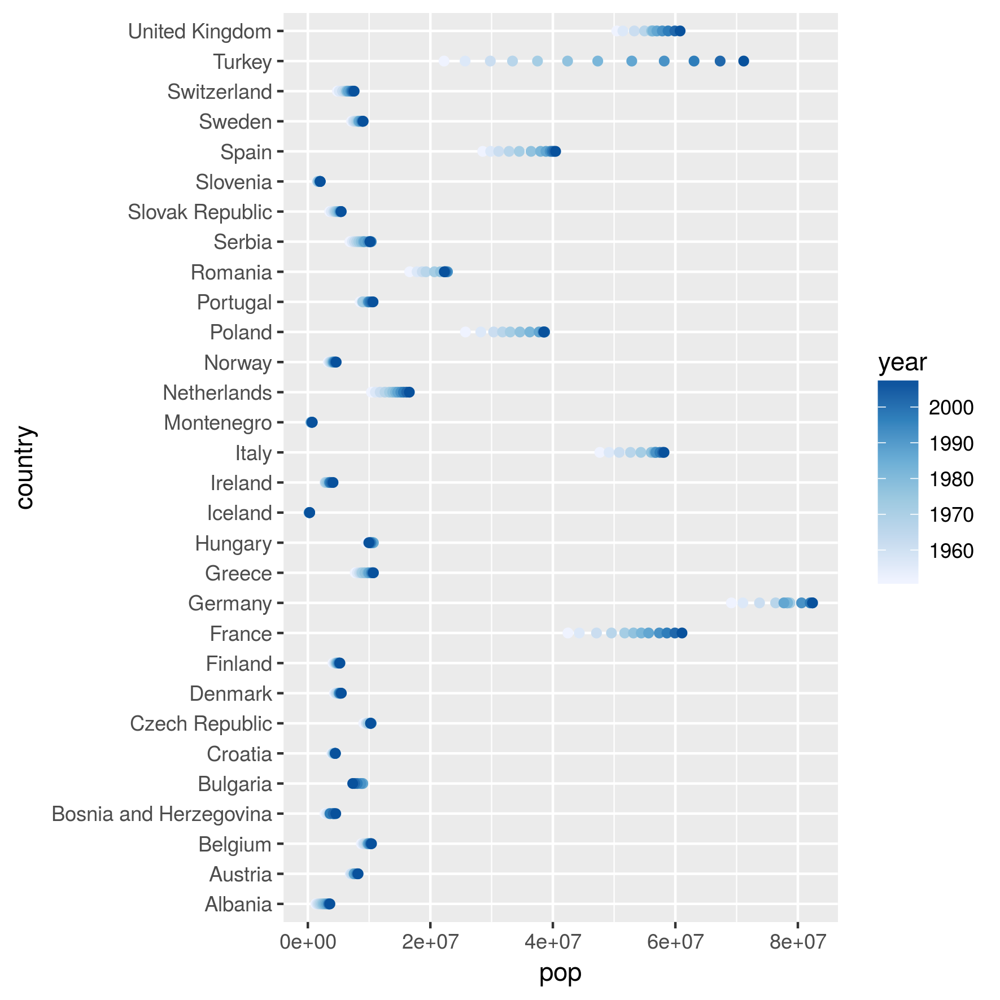

## Table of Contents

1. [Factor Management](#1)
    
    1.1. [Activity #1: Drop Oceania](#2)
    
    1.2. [Activity #2: Reorder the levels of country or continent](#3)
    
    1.3. [Activity #3: Practice writing to file and reading back](#4)
        
2. [File I/O](#5)

    2.1. [write_csv()/read_csv()](#6)
    
    2.2. [saveRDS()/readRDS()](#7)
    
    2.3. [dput()/dget()](#13)

3. [Visualization design](#8)

4. [Writing figures to file](#9)

5. [Clean up your repo!](#10)

7. [Report your process](#12)

In this homework I will work with the gapminder data. Let's start by loading the required liberaries:
```{r}
suppressWarnings(suppressMessages(library(tidyverse)))
library(tidyverse)
library(gapminder)
library(tidyr)
library(dplyr)
library(kableExtra)
library(knitr)
library(forcats)
```
Time to tackle the activities!

## <a id="1"></a> 1. Factor Management

**<a id="2"></a> 1.1. Activity #1: Drop Oceania**

Let's take a look at the data:

```{r}
str(gapminder)
```
We can see that the original gapminder dataset has 142 different countries, and 5 different continents. Let's learn more about Oceania by using 'fct_drop()' to only include Oceania:

```{r}
OC <- gapminder %>% 
  filter(continent %in% c("Oceania")) 

OC$country %>% 
  fct_drop() %>% 
  levels()
```
We can further see that there are two different countries under Oceania. To exclude Oceania, we can filter the data, and then use 'droplevels()':

```{r}
#filter the data and drop the extra level (Oceania)
gm_MinusOc <-gapminder %>% 
  filter(continent %in% c("Asia", "Africa", "Europe", "Americas"))%>%
  droplevels()

# let's take a look at the new dataframe
str(gm_MinusOc)
```


The new dataframe gm_MinusOc has only 4 continents, and the 2 countries under Oceania are dropped from country variable, leaving only 140 from the original 142 countries. Let's double check this with 'fct_count()':

```{r}
fct_count(gm_MinusOc$continent)
```

**<a id="3"></a> 1.2. Activity #2: Reorder the levels of country or continent**

One way is to reorder the factor levels  based on the highest to lowest gdpPercap for every continent:

Looking at the previous order:
```{r}
# previous order
head(levels(gapminder$continent)) 
``` 

And reordering:
```{r}
# reorder
head(levels(fct_reorder(gapminder$continent, gapminder$gdpPercap, max, .desc=TRUE)))
```

**<a id="4"></a> 1.3. Activity #3: Practice writing to file and reading back**

** Explore the effects of arrange():**

```{r}
#arrange the data
gm_dervied <- gapminder %>% 
  group_by(country) %>% 
  select(country, lifeExp) %>% 
  filter(lifeExp>80) %>% 
 arrange(desc(lifeExp)) 

#plot the arranged data 
gm_dervied %>% 
  ggplot(aes(y=country,x=lifeExp)) + geom_point()

#Show the head of the arraneged data
head(gm_dervied) %>% kable("html") %>% 
  kable_styling(bootstrap_options = c("striped", "hover", "condensed"))

```

From the above figure, arrange() does not change the order of levels and thus has no effect on the figure!

** Explore the effects of reordering a factor and factor reordering coupled with arrange():**

```{r}

#creating a new dataframe
gm_factor <- gapminder %>%
  filter(continent %in% c("Asia"), year >= 2007) %>% 
  select(country, gdpPercap) %>% 
  droplevels()

# before re-ordering
head(gm_factor) %>% kable("html") %>% 
  kable_styling(bootstrap_options = c("striped", "hover", "condensed"))

gm_factor %>% ggplot(aes(gdpPercap,country)) +geom_point()

# re-ordering a factor
gm_factor %>% ggplot(aes(x=gdpPercap, y=fct_reorder(country, gdpPercap, max,.desc = TRUE))) + geom_point()+scale_y_discrete("country")

# factor reordering coupled with arrange
gm_factor %>% 
  arrange(gdpPercap) %>% 
  ggplot(aes(x=gdpPercap, y=fct_reorder(country, gdpPercap, max,.desc = TRUE))) + geom_point()+scale_y_discrete("country")

```

From above, when fct_reorder() is coupled with arrange(), arrange() still does not change the order of levels and thus has no effect on the figure!

## <a id="5"></a> 2. File I/O

Let's create a new gapminder dataframe:

```{r}
gm_new <- gapminder %>% 
  group_by(country) %>% 
  filter(continent %in% c("Asia"), gdpPercap > 25000)
gm_new %>% head()

``` 

**<a id="6"></a> 2.1. write_csv()/read_csv()**

Using write_csv()/read_csv() to get a comma delimited file:

```{r}
readr::write_csv(gm_new, "gm_new.csv")

head(readr::read_csv("gm_new.csv"))
```

**<a id="7"></a> 2.2. saveRDS()/readRDS()**

Using saveRDS()/readRDS() to save and read data in RDS format:

```{r}
saveRDS(gm_new, "gm_new.rds")
head(readRDS("gm_new.rds"))
```

**<a id="13"></a> 2.3. dput()/dget()**

Using sdput()/dget() to save and read data in txt format:

```{r}
dput(gm_new, "gm_new.txt")
head(dget("gm_new.txt"))
```

## <a id="8"></a> 3. Visualization design

```{r}
#creating a new dataframe
gm_new2 <- gapminder %>%
  filter(continent %in% c("Europe")) %>% 
  select(country, pop, year, lifeExp) %>% 
  droplevels()

plot1 <- gm_new2%>%
  ggplot(aes(pop, country)) + geom_point(aes(colour=year))+scale_colour_distiller(palette="Blues", direction=1)

plot1
```

Let's only concentrate on populations greater than 5e+07, and look how population changes over time:

```{r}
#creating a new dataframe
gm_new3 <- gm_new2 %>%
  filter(pop > 5e+07) 

gm_new3%>%
  ggplot(aes(year, pop)) + geom_line(aes(group=country),alpha=0.5)
```

Even getting more specific, we can pick a single country (Turkey), and highlight how its population is changing over time:

```{r}

# blue line for Turkey, and black lines for other countries.
colour_layer <- scale_colour_manual("",labels=c("Other countries","Turkey"),values=c("black","blue"))

gm_new3%>%
  ggplot(aes(year, pop)) + #scale_alpha_discrete(range = c(0.2,1),guide=F) + 
  geom_line(aes(group=country, colour=country=="Turkey",alpha=country=="Turkey"),alpha=0.5) + 
  colour_layer
```

Doing something different with gm_new3, we can plot how the population and life expectancy of the top 3 countries in Europe changes over time:

```{r}

gm_new4 <- gm_new3 %>%
  mutate(PickedCountry = fct_lump(country, n=3)) %>%
  select(year, country, pop, lifeExp, PickedCountry) %>% 
  gather(key = "Measure", value = "value",pop:lifeExp)

gm_new4%>%
  filter(PickedCountry!="Other countries")%>%
  ggplot(aes(x = year, y = value, colour=PickedCountry)) + geom_point() + facet_wrap(~Measure,scales = "free", strip.position = c("top")) 

```

## <a id="9"></a> 4. Writing figures to file

Saving our first plot from above:

```{r}
ggsave("plot.pdf", width=15, height=15, units="cm", plot=plot1)
ggsave("plot.png", width=15, height=15, units="cm", plot=plot1)

```


 

## <a id="10"></a> 5. Clean up your repo!

Here is my [Repo](https://github.com/ssheikho/STAT545-hw-sheikholeslami-sara/tree/master) 

## <a id="12"></a> 7. Report your process

Overall, I found this assignment relatively easy to do but very long and time-consiming...

In this homework, it was easy to work with refactoring, and levels to have an overview of the levels of factor variable. 

Writing and reading into a file is pretty streight forward too!

I found data visualization challenging, because you need to have a good understanding of what is happening in the data to be able to use appropriate subsets of the data, and get meaningful figures!

