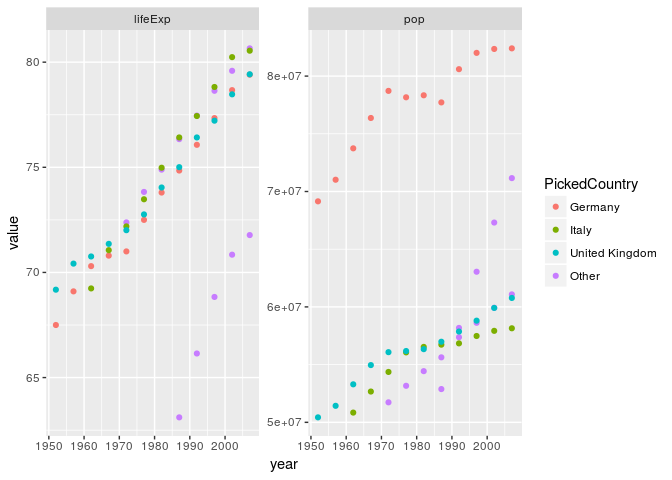

HW 5: Factor and figure management; Repo hygiene
================
Sara Sheikholeslami
2017-11-14

Table of Contents
-----------------

1.  [Factor Management](#1)

    1.1. [Activity \#1: Drop Oceania](#2)

    1.2. [Activity \#2: Reorder the levels of country or continent](#3)

    1.3. [Activity \#3: Practice writing to file and reading back](#4)

2.  [File I/O](#5)

    2.1. [write\_csv()/read\_csv()](#6)

    2.2. [saveRDS()/readRDS()](#7)

    2.3. [dput()/dget()](#13)

3.  [Visualization design](#8)

4.  [Writing figures to file](#9)

5.  [Clean up your repo!](#10)

6.  [But I want to do more!](#11)

7.  [Report your process](#12)

In this homework I will work with the gapminder data. Let's start by loading the required liberaries:

``` r
suppressWarnings(suppressMessages(library(tidyverse)))
library(tidyverse)
library(gapminder)
library(tidyr)
library(dplyr)
library(kableExtra)
library(knitr)
library(forcats)
```

Time to tackle the activities!

<a id="1"></a> 1. Factor Management
-----------------------------------

**<a id="2"></a> 1.1. Activity \#1: Drop Oceania**

Let's take a look at the data:

``` r
str(gapminder)
```

    ## Classes 'tbl_df', 'tbl' and 'data.frame':    1704 obs. of  6 variables:
    ##  $ country  : Factor w/ 142 levels "Afghanistan",..: 1 1 1 1 1 1 1 1 1 1 ...
    ##  $ continent: Factor w/ 5 levels "Africa","Americas",..: 3 3 3 3 3 3 3 3 3 3 ...
    ##  $ year     : int  1952 1957 1962 1967 1972 1977 1982 1987 1992 1997 ...
    ##  $ lifeExp  : num  28.8 30.3 32 34 36.1 ...
    ##  $ pop      : int  8425333 9240934 10267083 11537966 13079460 14880372 12881816 13867957 16317921 22227415 ...
    ##  $ gdpPercap: num  779 821 853 836 740 ...

We can see that the original gapminder dataset has 142 different countries, and 5 different continents. Let's learn more about Oceania by using 'fct\_drop()' to only include Oceania:

``` r
OC <- gapminder %>% 
  filter(continent %in% c("Oceania")) 

OC$country %>% 
  fct_drop() %>% 
  levels()
```

    ## [1] "Australia"   "New Zealand"

We can further see that there are two different countries under Oceania. To exclude Oceania, we can filter the data, and then use 'droplevels()':

``` r
#filter the data and drop the extra level (Oceania)
gm_MinusOc <-gapminder %>% 
  filter(continent %in% c("Asia", "Africa", "Europe", "Americas"))%>%
  droplevels()

# let's take a look at the new dataframe
str(gm_MinusOc)
```

    ## Classes 'tbl_df', 'tbl' and 'data.frame':    1680 obs. of  6 variables:
    ##  $ country  : Factor w/ 140 levels "Afghanistan",..: 1 1 1 1 1 1 1 1 1 1 ...
    ##  $ continent: Factor w/ 4 levels "Africa","Americas",..: 3 3 3 3 3 3 3 3 3 3 ...
    ##  $ year     : int  1952 1957 1962 1967 1972 1977 1982 1987 1992 1997 ...
    ##  $ lifeExp  : num  28.8 30.3 32 34 36.1 ...
    ##  $ pop      : int  8425333 9240934 10267083 11537966 13079460 14880372 12881816 13867957 16317921 22227415 ...
    ##  $ gdpPercap: num  779 821 853 836 740 ...

The new dataframe gm\_MinusOc has only 4 continents, and the 2 countries under Oceania are dropped from country variable, leaving only 140 from the original 142 countries. Let's double check this with 'fct\_count()':

``` r
fct_count(gm_MinusOc$continent)
```

    ## # A tibble: 4 x 2
    ##          f     n
    ##     <fctr> <int>
    ## 1   Africa   624
    ## 2 Americas   300
    ## 3     Asia   396
    ## 4   Europe   360

**<a id="3"></a> 1.2. Activity \#2: Reorder the levels of country or continent**

One way is to reorder the factor levels based on the highest to lowest gdpPercap for every continent:

Looking at the previous order:

``` r
# previous order
head(levels(gapminder$continent)) 
```

    ## [1] "Africa"   "Americas" "Asia"     "Europe"   "Oceania"

And reordering:

``` r
# reorder
head(levels(fct_reorder(gapminder$continent, gapminder$gdpPercap, max, .desc=TRUE)))
```

    ## [1] "Asia"     "Europe"   "Americas" "Oceania"  "Africa"

**<a id="4"></a> 1.3. Activity \#3: Practice writing to file and reading back**

\*\* Explore the effects of arrange():\*\*

``` r
#arrange the data
gm_dervied <- gapminder %>% 
  group_by(country) %>% 
  select(country, lifeExp) %>% 
  filter(lifeExp>80) %>% 
 arrange(desc(lifeExp)) 

#plot the arranged data 
gm_dervied %>% 
  ggplot(aes(y=country,x=lifeExp)) + geom_point()
```


``` r
#Show the head of the arraneged data
head(gm_dervied) %>% kable("html") %>% 
  kable_styling(bootstrap_options = c("striped", "hover", "condensed"))
```

<table class="table table-striped table-hover table-condensed" style="margin-left: auto; margin-right: auto;">
<thead>
<tr>
<th style="text-align:left;">
country
</th>
<th style="text-align:right;">
lifeExp
</th>
</tr>
</thead>
<tbody>
<tr>
<td style="text-align:left;">
Japan
</td>
<td style="text-align:right;">
82.603
</td>
</tr>
<tr>
<td style="text-align:left;">
Hong Kong, China
</td>
<td style="text-align:right;">
82.208
</td>
</tr>
<tr>
<td style="text-align:left;">
Japan
</td>
<td style="text-align:right;">
82.000
</td>
</tr>
<tr>
<td style="text-align:left;">
Iceland
</td>
<td style="text-align:right;">
81.757
</td>
</tr>
<tr>
<td style="text-align:left;">
Switzerland
</td>
<td style="text-align:right;">
81.701
</td>
</tr>
<tr>
<td style="text-align:left;">
Hong Kong, China
</td>
<td style="text-align:right;">
81.495
</td>
</tr>
</tbody>
</table>
From the above figure, arrange() does not change the order of levels and thus has no effect on the figure!

\*\* Explore the effects of reordering a factor and factor reordering coupled with arrange():\*\*

``` r
#creating a new dataframe
gm_factor <- gapminder %>%
  filter(continent %in% c("Asia"), year >= 2007) %>% 
  select(country, gdpPercap) %>% 
  droplevels()

# before re-ordering
head(gm_factor) %>% kable("html") %>% 
  kable_styling(bootstrap_options = c("striped", "hover", "condensed"))
```

<table class="table table-striped table-hover table-condensed" style="margin-left: auto; margin-right: auto;">
<thead>
<tr>
<th style="text-align:left;">
country
</th>
<th style="text-align:right;">
gdpPercap
</th>
</tr>
</thead>
<tbody>
<tr>
<td style="text-align:left;">
Afghanistan
</td>
<td style="text-align:right;">
974.5803
</td>
</tr>
<tr>
<td style="text-align:left;">
Bahrain
</td>
<td style="text-align:right;">
29796.0483
</td>
</tr>
<tr>
<td style="text-align:left;">
Bangladesh
</td>
<td style="text-align:right;">
1391.2538
</td>
</tr>
<tr>
<td style="text-align:left;">
Cambodia
</td>
<td style="text-align:right;">
1713.7787
</td>
</tr>
<tr>
<td style="text-align:left;">
China
</td>
<td style="text-align:right;">
4959.1149
</td>
</tr>
<tr>
<td style="text-align:left;">
Hong Kong, China
</td>
<td style="text-align:right;">
39724.9787
</td>
</tr>
</tbody>
</table>
``` r
gm_factor %>% ggplot(aes(gdpPercap,country)) +geom_point()
```


``` r
# re-ordering a factor
gm_factor %>% ggplot(aes(x=gdpPercap, y=fct_reorder(country, gdpPercap, max,.desc = TRUE))) + geom_point()+scale_y_discrete("country")
```


``` r
# factor reordering coupled with arrange
gm_factor %>% 
  arrange(gdpPercap) %>% 
  ggplot(aes(x=gdpPercap, y=fct_reorder(country, gdpPercap, max,.desc = TRUE))) + geom_point()+scale_y_discrete("country")
```


From above, when fct\_reorder() is coupled with arrange(), arrange() still does not change the order of levels and thus has no effect on the figure!

<a id="5"></a> 2. File I/O
--------------------------

Let's create a new gapminder dataframe:

``` r
gm_new <- gapminder %>% 
  group_by(country) %>% 
  filter(continent %in% c("Asia"), gdpPercap > 25000)
gm_new %>% head()
```

    ## # A tibble: 6 x 6
    ## # Groups:   country [4]
    ##            country continent  year lifeExp       pop gdpPercap
    ##             <fctr>    <fctr> <int>   <dbl>     <int>     <dbl>
    ## 1          Bahrain      Asia  2007  75.635    708573  29796.05
    ## 2 Hong Kong, China      Asia  1997  80.000   6495918  28377.63
    ## 3 Hong Kong, China      Asia  2002  81.495   6762476  30209.02
    ## 4 Hong Kong, China      Asia  2007  82.208   6980412  39724.98
    ## 5           Israel      Asia  2007  80.745   6426679  25523.28
    ## 6            Japan      Asia  1992  79.360 124329269  26824.90

**<a id="6"></a> 2.1. write\_csv()/read\_csv()**

Using write\_csv()/read\_csv() to get a comma delimited file:

``` r
readr::write_csv(gm_new, "gm_new.csv")

head(readr::read_csv("gm_new.csv"))
```

    ## Parsed with column specification:
    ## cols(
    ##   country = col_character(),
    ##   continent = col_character(),
    ##   year = col_integer(),
    ##   lifeExp = col_double(),
    ##   pop = col_integer(),
    ##   gdpPercap = col_double()
    ## )

    ## # A tibble: 6 x 6
    ##            country continent  year lifeExp       pop gdpPercap
    ##              <chr>     <chr> <int>   <dbl>     <int>     <dbl>
    ## 1          Bahrain      Asia  2007  75.635    708573  29796.05
    ## 2 Hong Kong, China      Asia  1997  80.000   6495918  28377.63
    ## 3 Hong Kong, China      Asia  2002  81.495   6762476  30209.02
    ## 4 Hong Kong, China      Asia  2007  82.208   6980412  39724.98
    ## 5           Israel      Asia  2007  80.745   6426679  25523.28
    ## 6            Japan      Asia  1992  79.360 124329269  26824.90

**<a id="7"></a> 2.2. saveRDS()/readRDS()**

Using saveRDS()/readRDS() to save and read data in RDS format:

``` r
saveRDS(gm_new, "gm_new.rds")
head(readRDS("gm_new.rds"))
```

    ## # A tibble: 6 x 6
    ## # Groups:   country [4]
    ##            country continent  year lifeExp       pop gdpPercap
    ##             <fctr>    <fctr> <int>   <dbl>     <int>     <dbl>
    ## 1          Bahrain      Asia  2007  75.635    708573  29796.05
    ## 2 Hong Kong, China      Asia  1997  80.000   6495918  28377.63
    ## 3 Hong Kong, China      Asia  2002  81.495   6762476  30209.02
    ## 4 Hong Kong, China      Asia  2007  82.208   6980412  39724.98
    ## 5           Israel      Asia  2007  80.745   6426679  25523.28
    ## 6            Japan      Asia  1992  79.360 124329269  26824.90

**<a id="13"></a> 2.3. dput()/dget()**

Using sdput()/dget() to save and read data in txt format:

``` r
dput(gm_new, "gm_new.txt")
head(dget("gm_new.txt"))
```

    ## # A tibble: 6 x 6
    ## # Groups:   country [4]
    ##            country continent  year lifeExp       pop gdpPercap
    ##             <fctr>    <fctr> <int>   <dbl>     <int>     <dbl>
    ## 1          Bahrain      Asia  2007  75.635    708573  29796.05
    ## 2 Hong Kong, China      Asia  1997  80.000   6495918  28377.63
    ## 3 Hong Kong, China      Asia  2002  81.495   6762476  30209.02
    ## 4 Hong Kong, China      Asia  2007  82.208   6980412  39724.98
    ## 5           Israel      Asia  2007  80.745   6426679  25523.28
    ## 6            Japan      Asia  1992  79.360 124329269  26824.90

<a id="8"></a> 3. Visualization design
--------------------------------------

``` r
#creating a new dataframe
gm_new2 <- gapminder %>%
  filter(continent %in% c("Europe")) %>% 
  select(country, pop, year, lifeExp) %>% 
  droplevels()

plot1 <- gm_new2%>%
  ggplot(aes(pop, country)) + geom_point(aes(colour=year))+scale_colour_distiller(palette="Blues", direction=1)

plot1
```


Let's only concentrate on populations greater than 5e+07, and look how population changes over time:

``` r
#creating a new dataframe
gm_new3 <- gm_new2 %>%
  filter(pop > 5e+07) 

gm_new3%>%
  ggplot(aes(year, pop)) + geom_line(aes(group=country),alpha=0.5)
```


Even getting more specific, we can pick a single country (Turkey), and highlight how its population is changing over time:

``` r
# blue line for Turkey, and black lines for other countries.
colour_layer <- scale_colour_manual("",labels=c("Other countries","Turkey"),values=c("black","blue"))

gm_new3%>%
  ggplot(aes(year, pop)) + #scale_alpha_discrete(range = c(0.2,1),guide=F) + 
  geom_line(aes(group=country, colour=country=="Turkey",alpha=country=="Turkey"),alpha=0.5) + 
  colour_layer
```


Doing something different with gm\_new3, we can plot how the population and life expectancy of the top 3 countries in Europe changes over time:

``` r
gm_new4 <- gm_new3 %>%
  mutate(PickedCountry = fct_lump(country, n=3)) %>%
  select(year, country, pop, lifeExp, PickedCountry) %>% 
  gather(key = "Measure", value = "value",pop:lifeExp)

gm_new4%>%
  filter(PickedCountry!="Other countries")%>%
  ggplot(aes(x = year, y = value, colour=PickedCountry)) + geom_point() + facet_wrap(~Measure,scales = "free", strip.position = c("top")) 
```



<a id="9"></a> 4. Writing figures to file
-----------------------------------------

Saving our first plot from above:

``` r
ggsave("plot.pdf", width=15, height=15, units="cm", plot=plot1)
ggsave("plot.png", width=15, height=15, units="cm", plot=plot1)
```


ggsave("my plot.pdf", width=15, height=10, units="cm", plot=p) ggsave("my plot.png", width=15, height=10, units="cm", plot=p)

<a id="10"></a> 5. Clean up your repo!
--------------------------------------

<a id="11"></a> 6. But I want to do more!
-----------------------------------------

<a id="12"></a> 7. Report your process
--------------------------------------

Overall I found this assignment easy to do. - I spent a lot of time trying to do 3d scatter plots but I was not able to generate a sensible visualization.... - I found using the join functions over and over a bit tedious!
